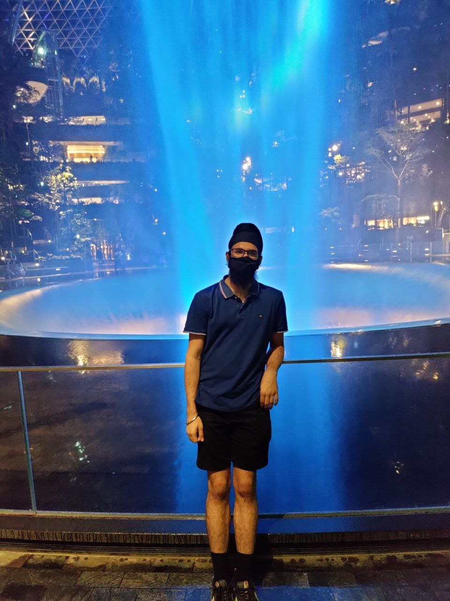
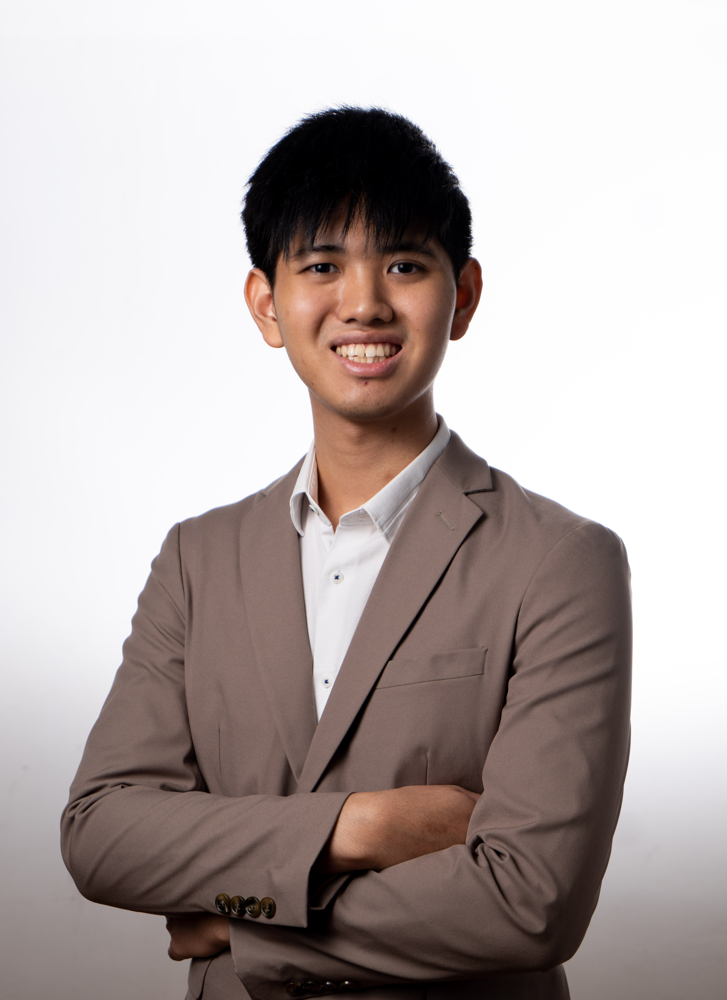
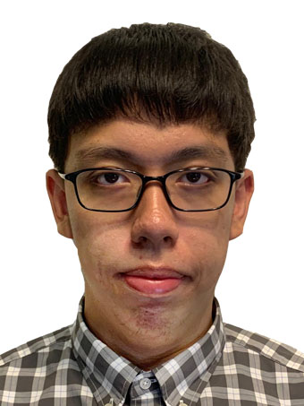
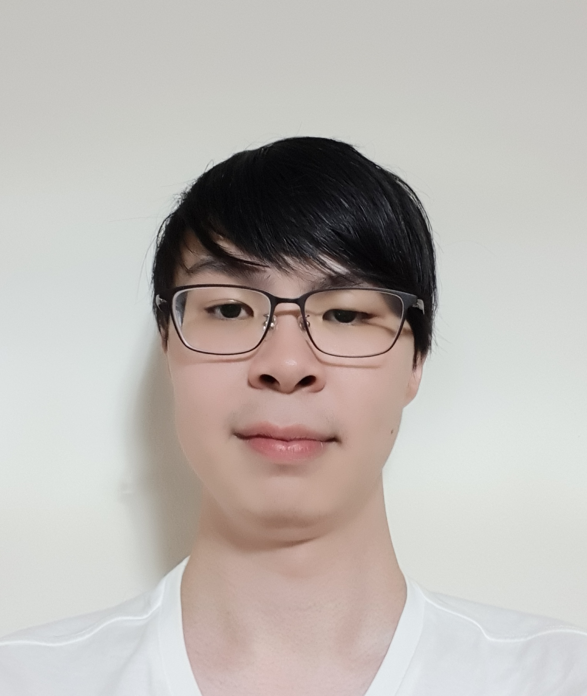

We are a team based in the [School of Computing, National University of Singapore](http://www.comp.nus.edu.sg).

You can reach us at the email `seer[at]comp.nus.edu.sg`

## Project team

### Agamjyot Singh Chadha

[[github](https://github.com/garfield-oo7)]
[[portfolio](team/garfield-oo7.md)]

* Role: Project Advisor

### Charles Lim Jun Hao

[[github](http://github.com/charleslimjh)]
[[portfolio](team/charleslimjh.md)]

* Role: Team Lead
* Responsibilities: Documentation

### Debbie Wu

[[github](http://github.com/debwy)] [[portfolio](team/debwy.md)]

* Role: Developer
* Responsibilities: Documentation

### Francis Tan Tze Yong

[[github](http://github.com/Francis-Tan)]
[[portfolio](team/francis-tan.md)]

* Role: Developer
* Responsibilities: Dev Ops + Threading

### Koh Shang Hui

[[github](http://github.com/prearo)]
[[portfolio](team/prearo.md)]

* Role: Developer
* Responsibilities: Integration, Git Expert
