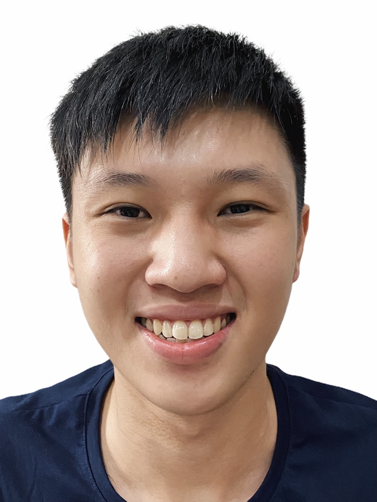

We are a team based in the [School of Computing, National University of Singapore](http://www.comp.nus.edu.sg).

You can reach us at the email `seer[at]comp.nus.edu.sg`

## Project Team

### Quah Kian Seong

[[github](https://github.com/KIANSEONG)]

* Role: Project Advisor

### Wang Xinyi

GitHub: [@wxy1203](https://github.com/wxy1203)

* Role: Team Member
* Responsibilities: Various

### Brandon Thio

GitHub: [@beetee17](https://github.com/beetee17)
[[portfolio](team/johndoe.md)]

* Role: Team Member
* Responsibilities: Various

### Zheng Yilin

[[github](http://github.com/yilinzyl)] 
[[portfolio](team/johndoe.md)]

* Role: Developer
* Responsibilities: Data

### Amresh

[[github](http://github.com/johndoe)]
[[portfolio](team/johndoe.md)]

* Role: Developer
* Responsibilities: Dev Ops + Threading

