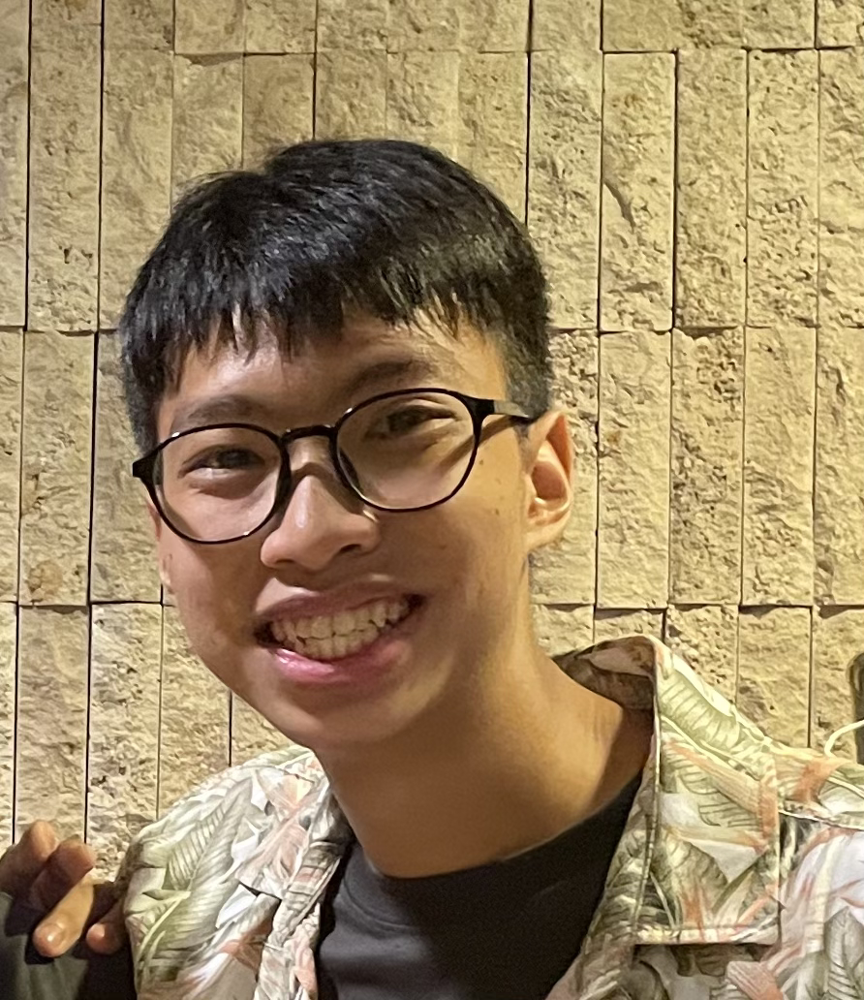

# About Us

GREWZ is an integrated platform for teacher assistants in university, with the aim of helping teacher assistants to manage their students efficiently. 
Wanting to help fellow teacher assistants, we are working together to develop a comprehensive address book that answers their needs.

We are a team based in the [School of Computing, National University of Singapore](http://www.comp.nus.edu.sg).

You can reach us at the email `seer[at]comp.nus.edu.sg`

## Project team

### John Doe

[[homepage](http://www.comp.nus.edu.sg/~damithch)]
[[github](https://github.com/johndoe)]
[[portfolio](team/johndoe.md)]

* Role: Project Advisor

### Jane Doe

[[github](http://github.com/johndoe)]
[[portfolio](team/johndoe.md)]

* Role: Team Lead
* Responsibilities: UI

### Evan Loo

[[github](http://github.com/evande1)] [[portfolio](team/evande1.md)]

* Role: Code quality
* Responsibilities: Ensures adherence to code quality and practices.

### Lee Wai Chong

[[github](https://github.com/Whysochong)]
[[portfolio](team/waichong.md)]

* Role: Developer
* Responsibilities: Project Advisor, Code Testing

### Thian Zhang Zhi

[[github](http://github.com/johndoe)]
[[portfolio](team/johndoe.md)]

* Role: Developer
* Responsibilities: UI
