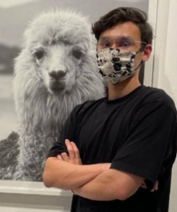

# About Us

ModtRekt is a tool for students of NUS to manage their modules and tasks.

We are a team based in the [School of Computing, National University of Singapore](http://www.comp.nus.edu.sg).

## Project team

### Jonathan Tay Ming-Yang

[[github](https://github.com/jontmy)]
[[portfolio](team/jontmy.md)]

* Role: Team lead
* Responsibilities: Deliverables and deadlines, Scheduling and tracking

### Ho Jun Hao

[[github](http://github.com/hojunhao2000)]
[[portfolio](team/hojunhao2000.md)]

* Role: Developer
* Responsibilities: Code quality

### Marciano Renzo William

[[github](http://github.com/midnightfeverrr)] [[portfolio](team/midnightfeverrr.md)]

* Role: Developer
* Responsibilities: Testing

### Dominic Berzin Chua Way Gin

[[github](http://github.com/domoberzin)]
[[portfolio](team/domoberzin.md)]

* Role: Developer
* Responsibilities: Documentation

### David Gareth Ong

[[github](http://github.com/vvidday)]
[[portfolio](team/vvidday.md)]

* Role: Developer
* Responsibilities: Integration
