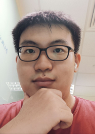
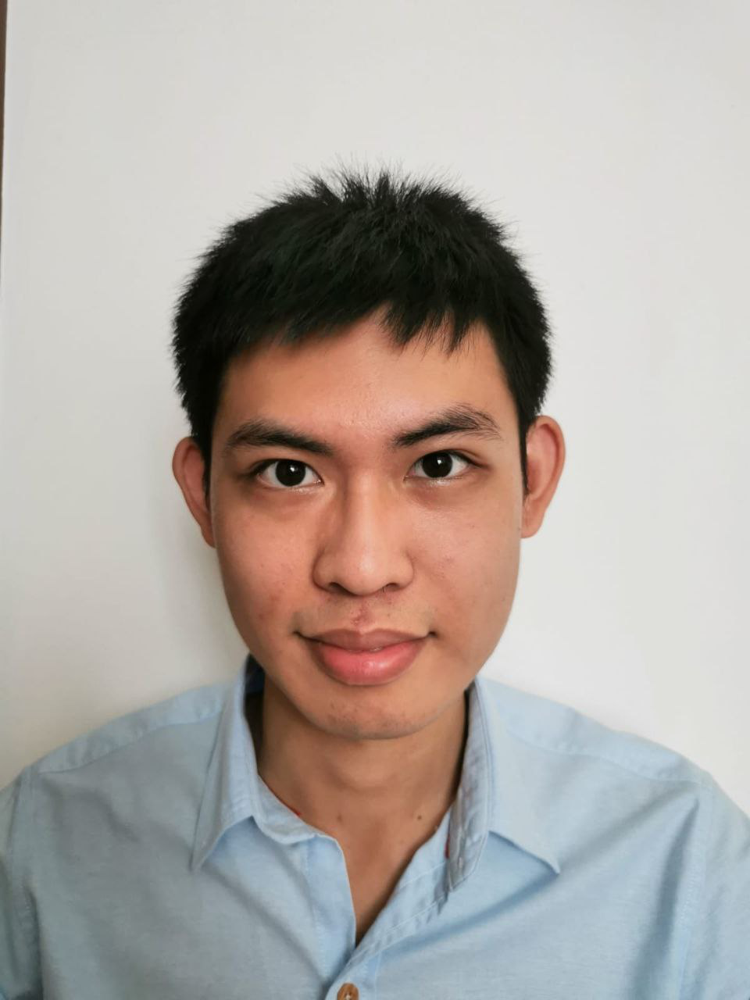
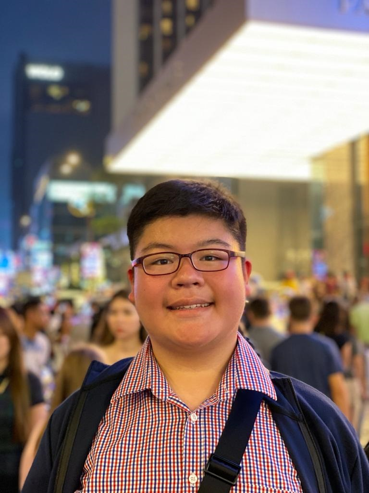
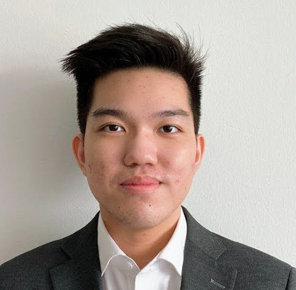

We are a team based in the [School of Computing, National University of Singapore](http://www.comp.nus.edu.sg).

You can reach us at the email `seer[at]comp.nus.edu.sg`

## Project team

### Li Zhaoqi

[[github](https://github.com/Eclipse-Dominator)]
[[portfolio](team/eclipse-dominator.md)]

- Role: Developer
- Responsibilities: Something

### Eric Lee Ying Yao

[[github](http://github.com/autumn-sonata)]
[[portfolio](team/autumn-sonata.md)]

- Role: Developer
- Responsibilities: Something

### Jason Christopher

[[github](http://github.com/jasonchristopher21)]
[[portfolio](team/jasonchristopher21.md)]

* Role: Developer
* Responsibilities: TBA

### Connor Lim

[[github](https://github.com/connlim)]
[[portfolio](team/connlim.md)]

* Role: Developer
* Responsibilities: In charge of Tasks, Quality Assurance

### Mohamed Safwan

[[github](http://github.com/mohamedsaf1)]
[[portfolio](team/mohamedsaf1.md)]

* Role: Developer
* Responsibilities: Basic Functions

