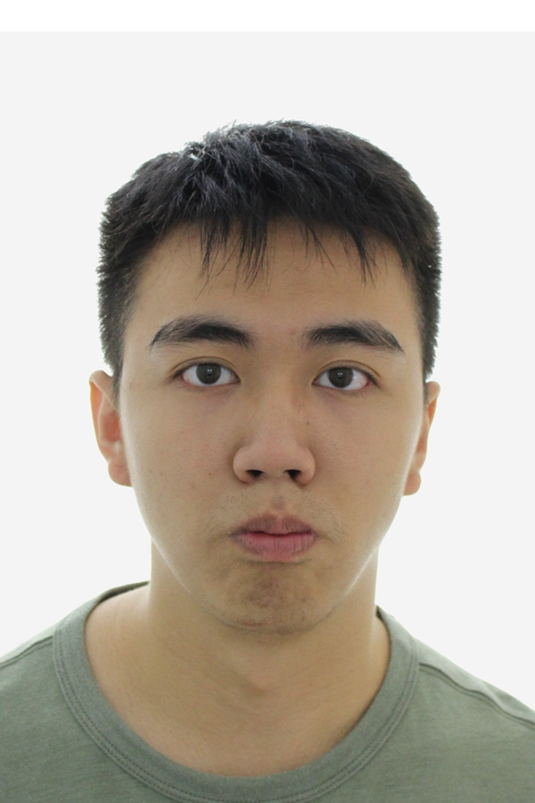
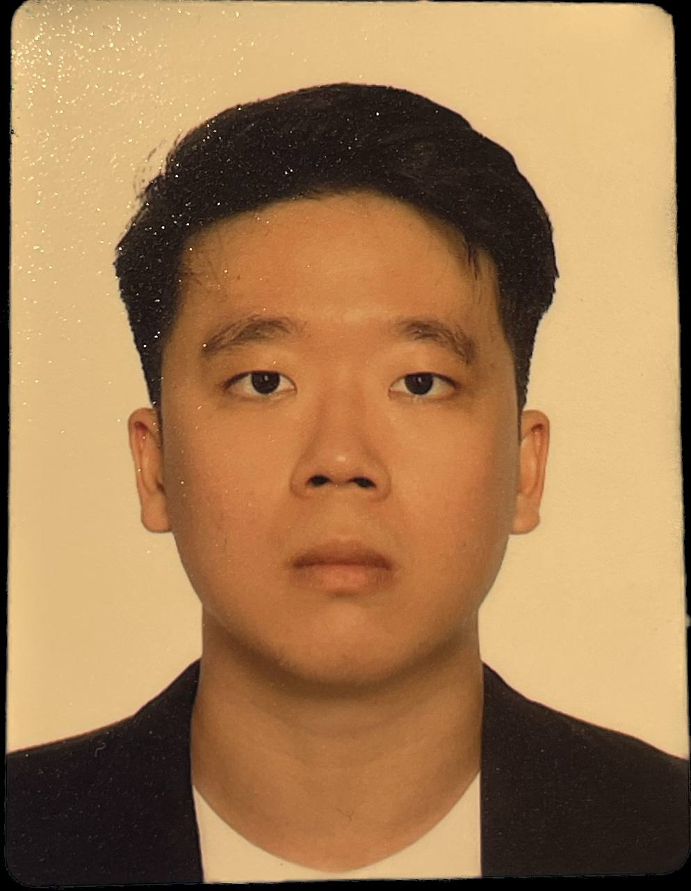

We are a team based in the [School of Computing, National University of Singapore](http://www.comp.nus.edu.sg).

You can reach us at the email `seer[at]comp.nus.edu.sg`

## Project team

### Nitant Panicker

[[github](https://github.com/nitant-p)]

[[portfolio](team/nitant-p.md)]

* Role: Project Advisor

### Png Yi Wei Jonas

[[github](http://github.com/jonaspng)]

[[portfolio](team/jonaspng.md)]

* Role: Team Lead
* Responsibility: DevOps

### Joe Yi

[[github](http://github.com/jjoeyi)]

[[portfolio](team/jjoeyi.md)]

* Role: Developer

### Norman Koh

[[github](http://github.com/normkoh)]

[[portfolio](team/normkoh.md)]

* Role: Developer
* Responsibilities: UI

### Gareth Ong

[[github](http://github.com/GarethOng)]

[[portfolio](team/garethong.md)]

* Role: Developer
* Responsibilities: Data
