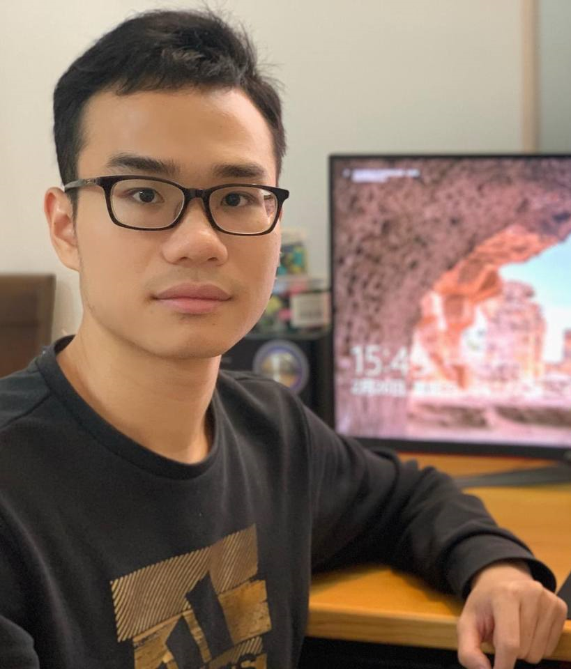
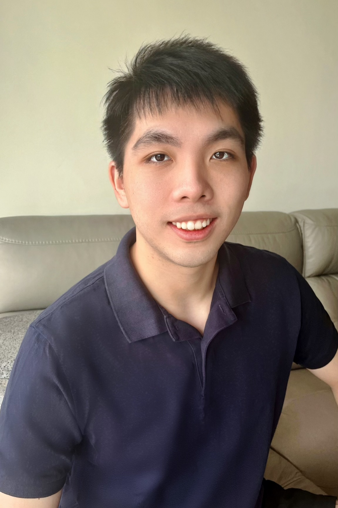
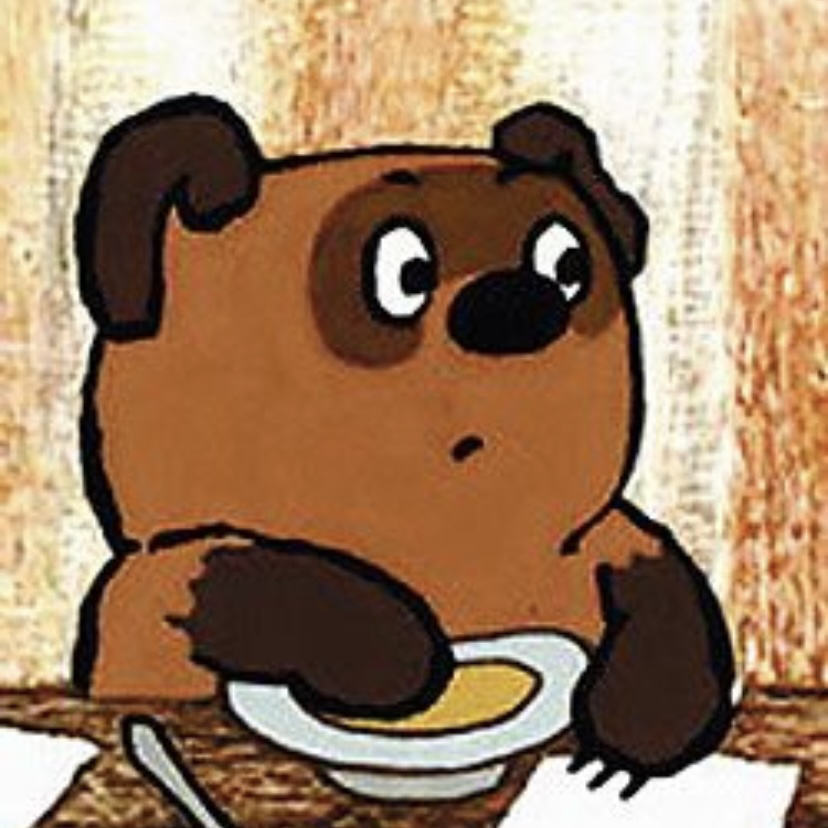
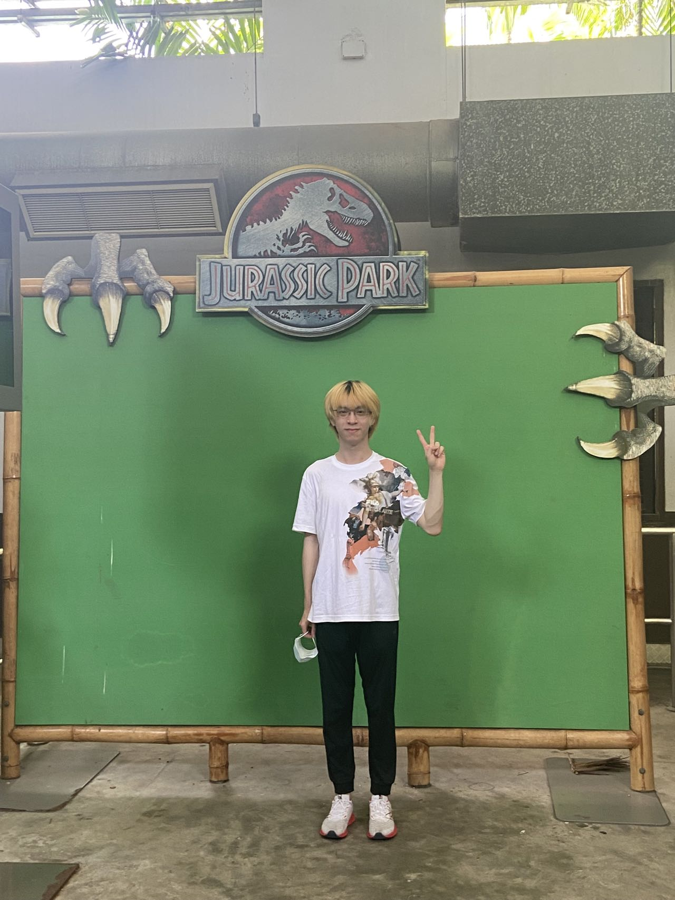
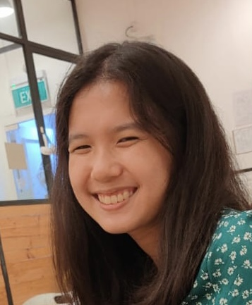

We are a team based in the [School of Computing, National University of Singapore](http://www.comp.nus.edu.sg).

You can reach us at the email `seer@comp.nus.edu.sg`

## PetCode Team

### Wu Lezheng

[[github](http://github.com/Wu-Lezheng)]
[[portfolio](team/wu-lezheng.md)]

* Role: *UI designer, Developer, Proofreader, Manual tester, Project manager*.
* Responsibilities: Task management, creation and modification of UI, addition and modification of some features, proofreading and editing of documents, manual testing and bug reporting.  

### Zhang Weiqiang

[[github](http://github.com/wweqg)]
[[portfolio](team/wweqg.md)]

* Role: *to be added*
* Responsibilities: *to be added*

### Faith Chua

[[github](http://github.com/boredcoco)]
[[portfolio](team/boredcoco.md)]

* Role: *Tester, Developer*
* Responsibilities: *Filter and Find features, testing*

### Huang Hongyi

[[github](https://github.com/Hongyi6328)]
[[portfolio](team/hongyi6328.md)]

* Role: Developer
* Responsibilities: Issue Manager, UI

### Hong Ker Yen Elizabeth

[[github](https://github.com/elizabethhky)]
[[portfolio](team/elizabethhky.md)]

* Role: *to be added*
* Responsibilites: *to be added*
