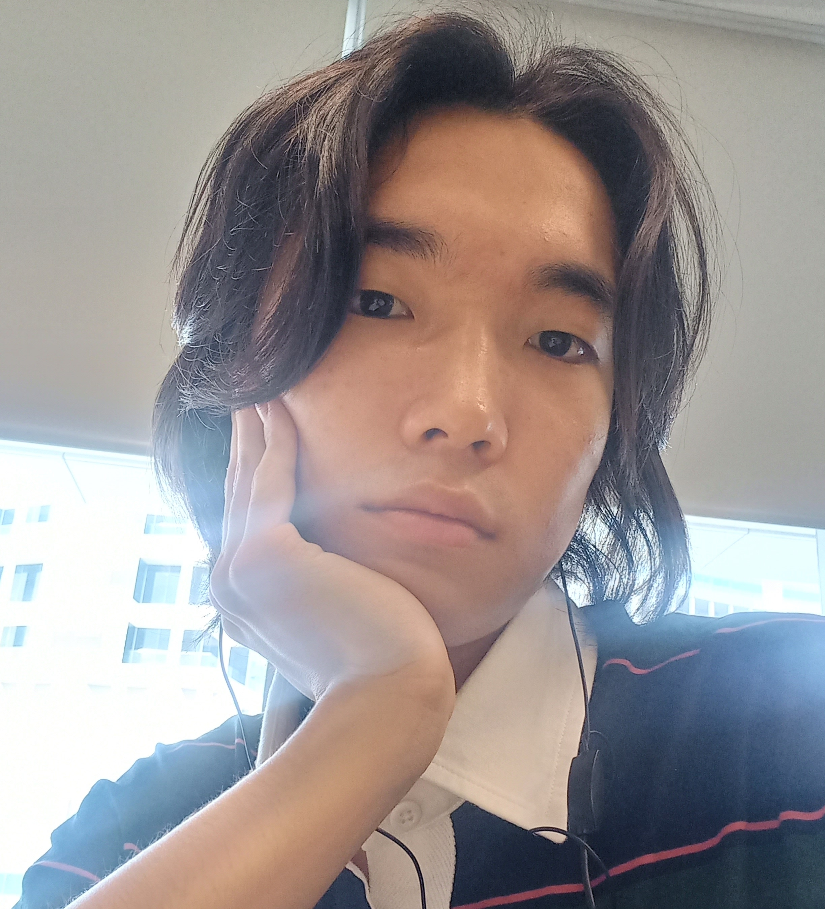
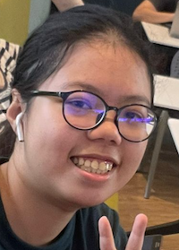
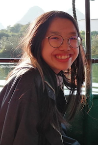
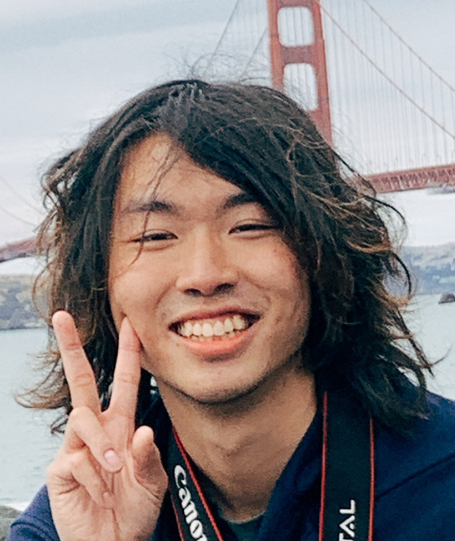

We are a team based in the [School of Computing, National University of Singapore](http://www.comp.nus.edu.sg).

You can reach us at the email `seer[at]comp.nus.edu.sg`

## Project team

### Nyamdavaa Amar

[[github](http://github.com/nvmdava)]
[[portfolio](team/nvmdava.md)]

* Role: Team Lead
* Responsibilities: Storage

### Leong See Leng

[[github](http://github.com/seelengxd)]
[[portfolio](team/seelengxd.md)]

* Role: Developer
* Responsibilities: Model, Code Quality

### Chloe Lim

[[github](http://github.com/chloeelim)]
[[portfolio](team/chloeelim.md)]

* Role: Developer
* Responsibilities: UI, Integration

### Ng Xing Yu

[[github](http://github.com/ngxingyu)]
[[portfolio](team/ngxingyu.md)]

* Role: Developer
* Responsibilities: Logic + Testing

### James Chiu

[[github](http://github.com/zlimez)]
[[portfolio](team/zlimez.md)]

* Role: Developer
* Responsibilities: Model + Documentation
