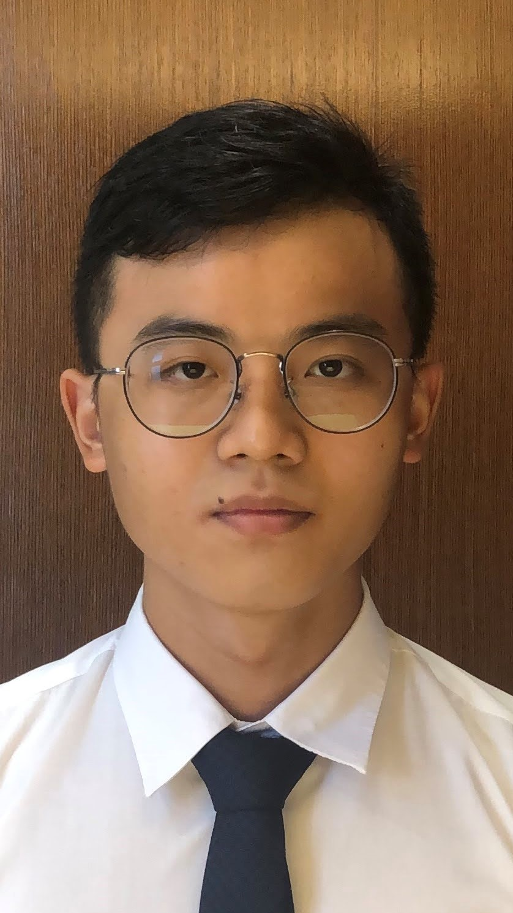
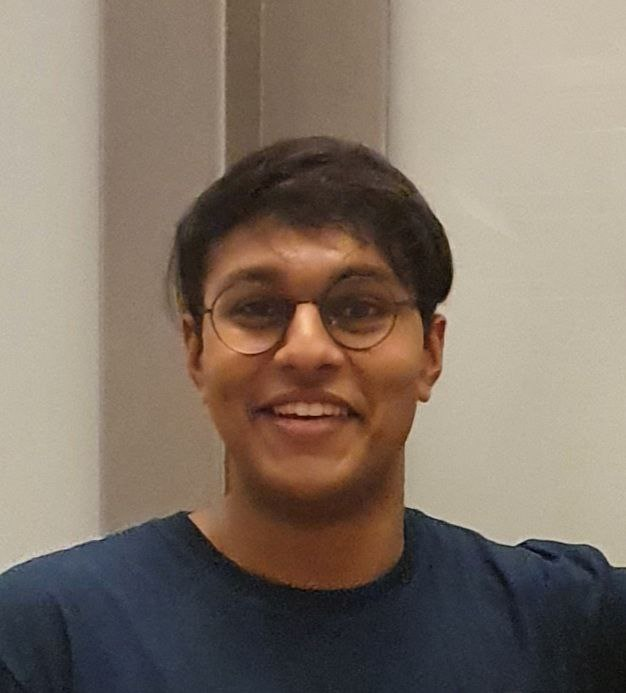
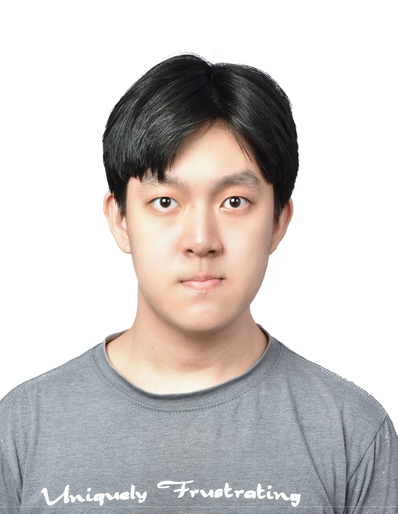

We are a team based in the [School of Computing, National University of Singapore](http://www.comp.nus.edu.sg).

## Project team

### Chao Yung

<kbd></kbd>

[[github](https://github.com/chao890)]
[[portfolio](team/chao890.md)]

- Role: Developer, Git Expert
- Responsibilities: Documentation

### Kevin Chang

<kbd></kbd>

[[github](http://github.com/kevinchangjk)]
[[portfolio](team/kevinchangjk.md)]

- Role: Developer
- Responsibilities: Backend, Code Quality

### Prittam Ravi

<kbd></kbd>

[[github](https://github.com/prit3010)]
[[portfolio](team/prit3010.md)]

- Role: Team Lead
- Responsibilities: Scheduling & Tracking, Deliverables & Deadlines

### Shawn Kok

<kbd></kbd>

[[github](https://github.com/Kok-je)]
[[portfolio](team/kok-je.md)]

- Role: Developer, IntelliJ expert, Figma expert
- Responsibilities: Testing, Integration, UI

### Ng Shi Jun

<kbd></kbd>

[[github](http://github.com/ngshijun)]
[[portfolio](team/ngshijun.md)]

- Role: Developer
- Responsibilities: Frontend, UI
