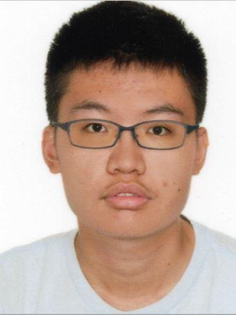
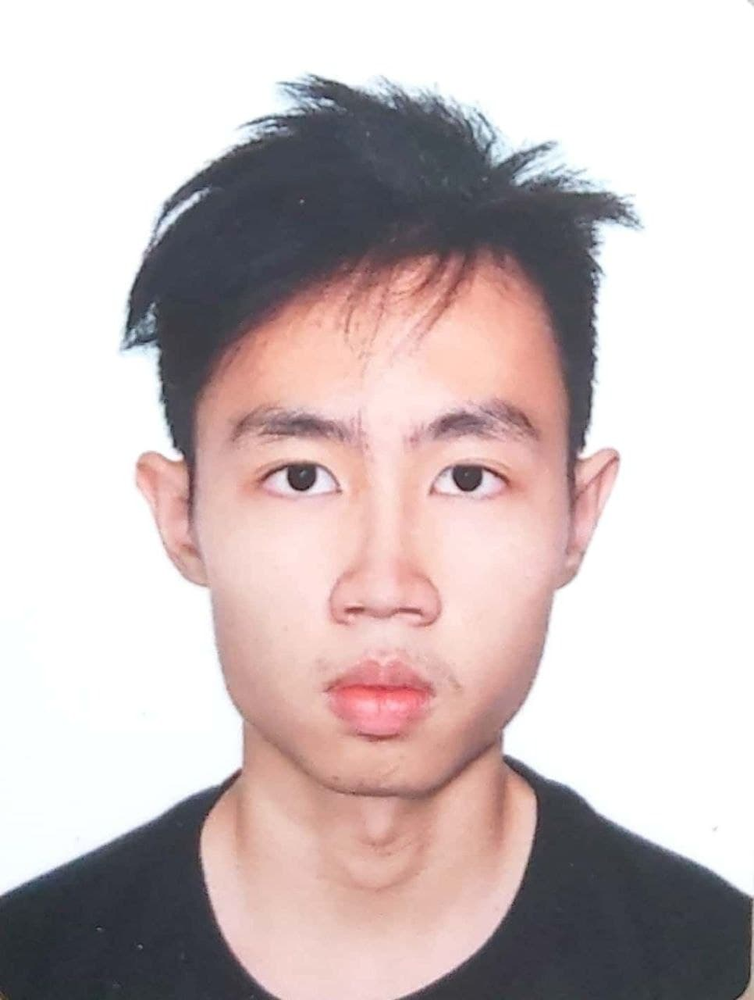
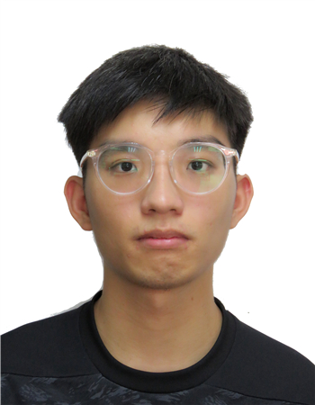

We are a team based in the [School of Computing, National University of Singapore](http://www.comp.nus.edu.sg).

## Project team

### Tan Wen Hao Brendan

[[github](https://github.com/nerbnerb)]
[[portfolio](team/nerbnerb.md)]

* Role: Developer
* Responsibilities: UI

### Desmond Yong Shao Tian

[[github](https://github.com/desmondyst)]
[[portfolio](team/desmondyst.md)]

* Role: Developer
* Responsibilities: `Mark` command, User guide, Developer Guide

### Lee Ian Ee

[[github](https://github.com/leeianee)] [[portfolio](team/leeianee.md)]

* Role: Developer
* Responsibilities: `Add` command, User guide, Developer Guide

### Marcus Isaac Goh Wei Jie

[[github](https://github.com/Marcusgwj)]
[[portfolio](team/marcusgwj.md)]

* Role: Developer
* Responsibilities: `Sort` command, User guide, Developer Guide

### Tee Yi Teng

[[github](https://github.com/Puakii)]
[[portfolio](team/puakii.md)]

* Role: Developer
* Responsibilities: `Find` command, refactoring from `Person` to `Internship`, user guide and developer guide
