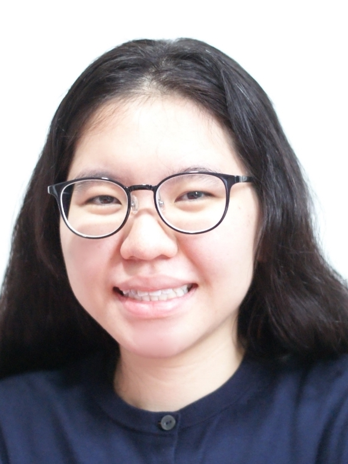
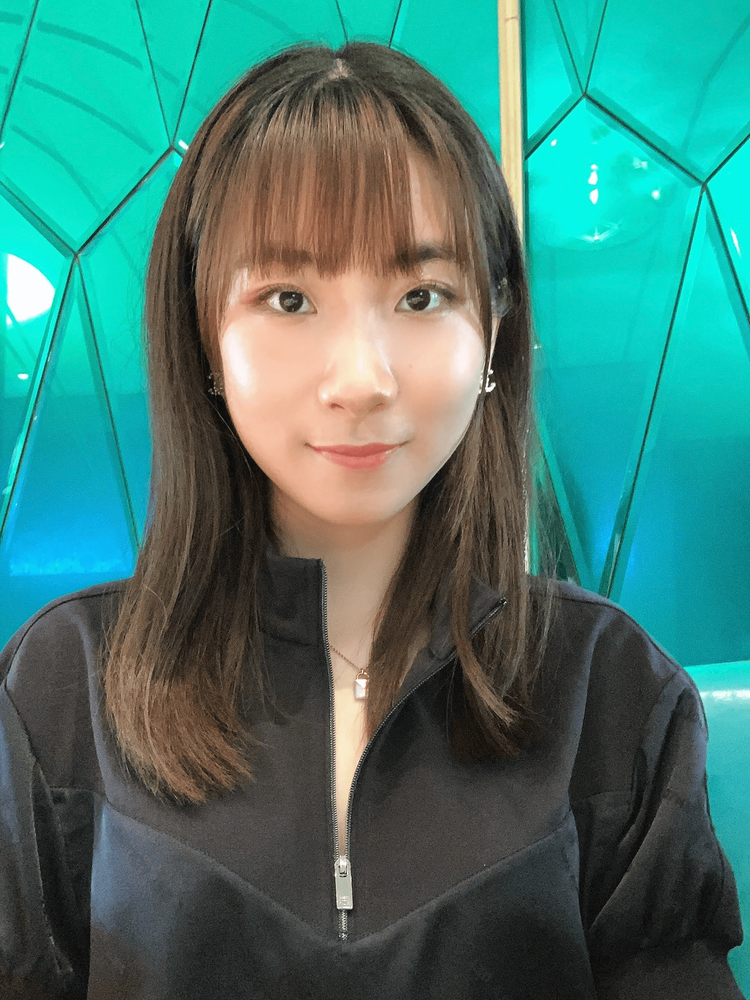

We are Team Mass Linkers, a team based in the [School of Computing, National University of Singapore](http://www.comp.nus.edu.sg).

We strive to use our tech skills to solve problems faced by students and make peer support accessible and convenient for all. 

You can find out more about our work below or reach out to us via the portfolio links below.

## Project team

### Chin Hong Ming

[[github](http://github.com/chm252)]
[[portfolio](team/chm252.md)]

* Role: Developer
* Responsibilities: Model, Integration

### Sheryl-Lynn Tan

[[github](https://github.com/sltsheryl)] [[portfolio](team/sltsheryl.md)]

* Role: Developer
* Responsibilities: UI, Student Information

### Zheng Jiarui

[[github](https://github.com/carriezhengjr)] [[portfolio](team/carriezhengjr.md)]

* Role: Developer
* Responsibilities: User Guide, Logic

### Elijah Seah

[[github](https://github.com/elijahs67)]
[[portfolio](team/elijahs67.md)]

* Role: Developer
* Responsibilities: Commons, Testing

### Jonas Goh

[[github](http://github.com/jonasgwt)]
[[portfolio](team/jonasgwt.md)]

* Role: Developer
* Responsibilities: Storage
