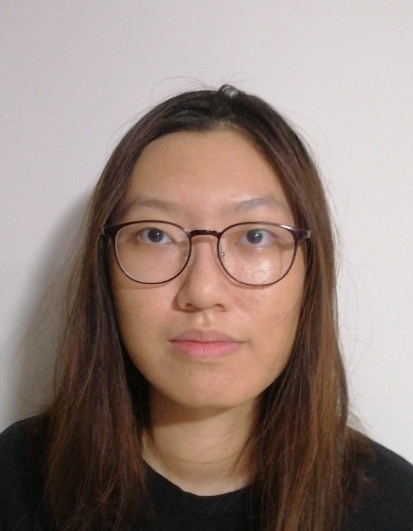

We are a team based in the [School of Computing, National University of Singapore](http://www.comp.nus.edu.sg).

You can reach us at the email `seer[at]comp.nus.edu.sg`

## Project team

### John Benedict Yan

[[github](https://github.com/johnbenedictyan)]
[[portfolio](team/johnbenedictyan.md)]

* Role: Team Lead and Code Quality In-Charge
* Responsibilities: Commons

### John Benedict

[[github](http://github.com/johnbenedictyan)]
[[portfolio](team/johnbenedictyan.md)]

* Role: Team Lead, Code Quality
* Responsibilities: Commons

### Phoong Xiang Han

[[github](http://github.com/xhphoong)]
[[portfolio](team/xhphoong.md)]

* Role: Documentation In-Charge
* Responsibilities: Logic

### Yee Hao

[[github](http://github.com/yeehaoo)] [[portfolio](team/yeehaoo.md)]

* Role: Deliverables and deadlines, and Scheduling and tracking In-Charge
* Responsibilities: Model

### Malcolm Low

[[github](http://github.com/mlzt2000)]
[[portfolio](team/mlzt2000.md)]

* Role: Integration In-Charge
* Responsibilities: User Interface

### Lim Zhan Feng

[[github](http://github.com/lolfoollors)]
[[portfolio](team/lolfoollors.md)]

* Role: Testing In-Charge
* Responsibilities: Storage
