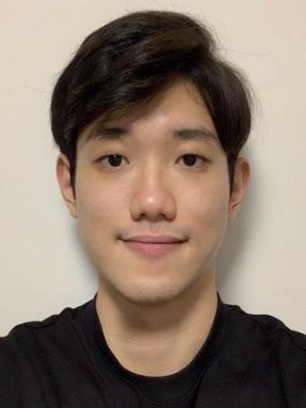
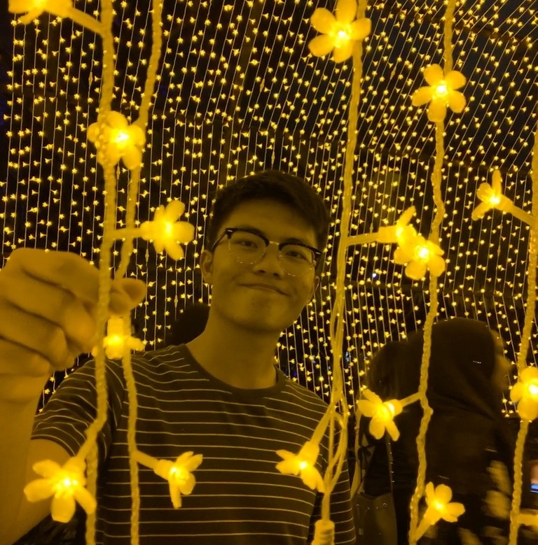
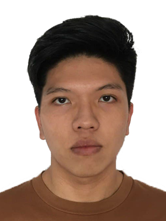

We are a team based in the [School of Computing, National University of Singapore](http://www.comp.nus.edu.sg).

You can reach us at the email `seer[at]comp.nus.edu.sg`

## Project team

### Thomas Ho

[[github](http://github.com/ThomasHoooo)]
[[portfolio](team/thomashoooo.md)]

* Role:
    * Team Lead
    * Git expert

### Chang Si Kai

[[github](http://github.com/sikai00)]
[[portfolio](team/sikai00.md)]

* Role:
    * Developer
* Responsibilities: 
    * Testing
    * Integration

### Ong Han Wei

[[github](http://github.com/rexong)]
[[portfolio](team/rexong.md)]

* Role:
    * Developer
* Responsibilities:
    * Code quality
    * Testing

### Moo Jun Wei

[[github](http://github.com/junweimoo)]
[[portfolio](team/junweimoo.md)]

* Role:
    * Developer
* Responsibilities:
    * UI
    * Deliverables and deadlines
    * Scheduling and tracking

### Tina Agarwal

[[github](http://github.com/Thing1Thing2)]
[[portfolio](team/thing1thing2.md)]

* Role:
    * Developer
* Responsibilities:
    * Documentation
