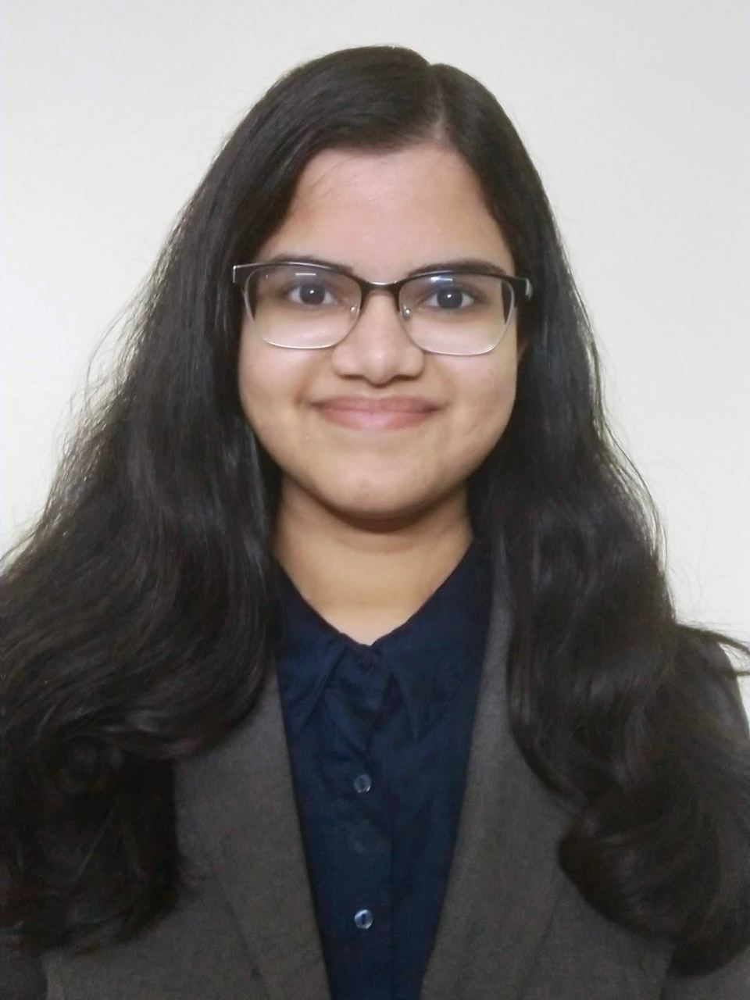
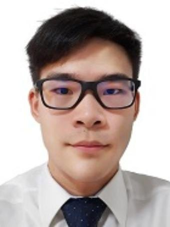
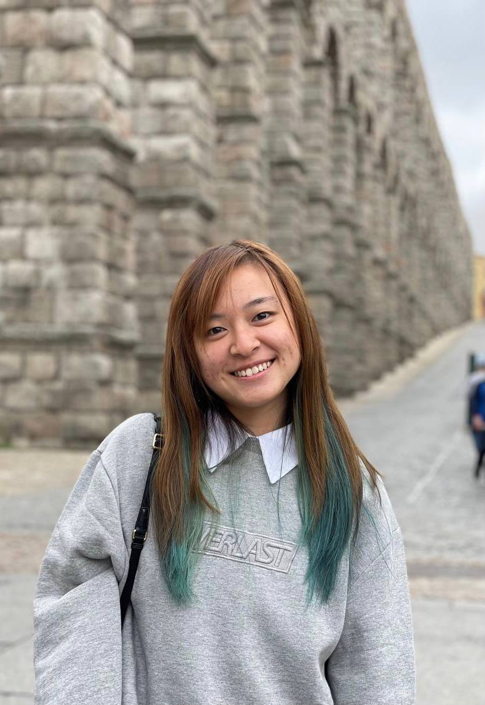
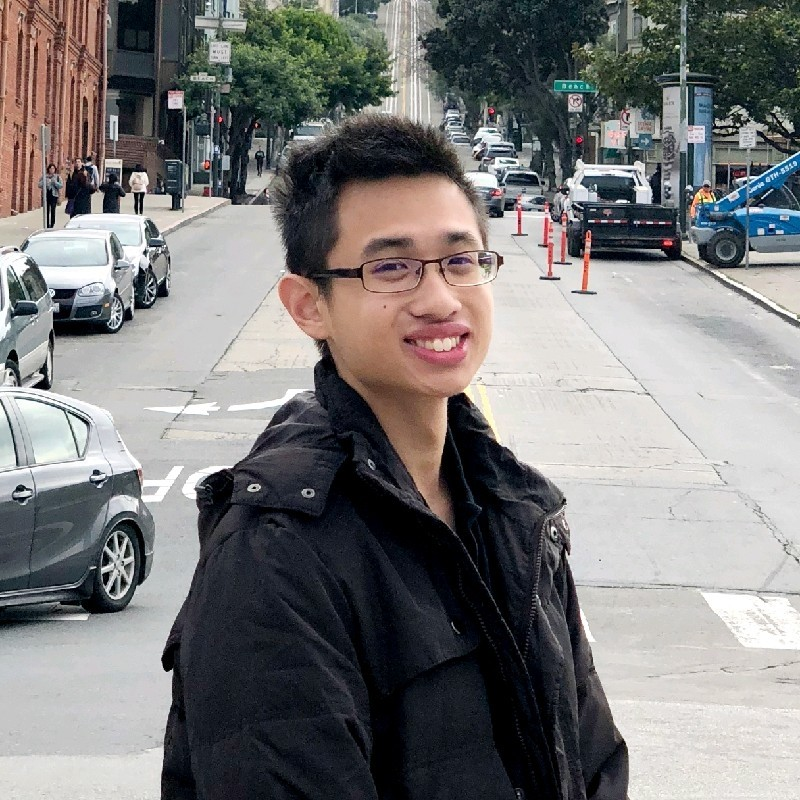
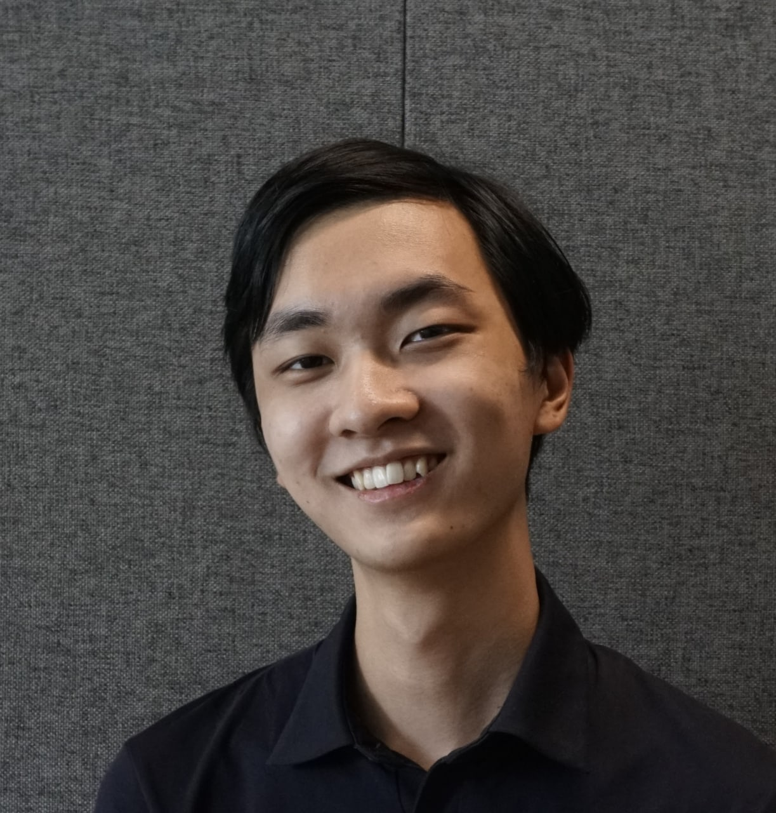

We are a team based in the [School of Computing, National University of Singapore](http://www.comp.nus.edu.sg).

## Project team

### Aishwarya Hariharan Iyer

[[github](https://github.com/Aishwarya-Hariharan-Iyer)]
[[portfolio](team/aishwarya-hariharan-iyer.md)]

* Role: Developer
* Responsibilities: UI

### Lew Kian Loong, Conrad

[[github](https://github.com/ConradLew)]
[[portfolio](team/conradlew.md)]

* Role: Team Lead
* Responsibilities: Data

### Crystal Phua

[[github](https://github.com/crvstalphua)]
[[portfolio](team/crvstalphua.md)]

* Role: Developer
* Responsibilities: UI

### Donovan Singh

[[github](https://github.com/Donovan9617)]
[[portfolio](team/donovan9617.md)]

* Role: Developer
* Responsibilities: UI

### Kim Yong Beom

[[github](https://github.com/Yongbeom-Kim)]
[[portfolio](team/yongbeom-kim.md)]

* Role: Developer
* Responsibilities: UI
