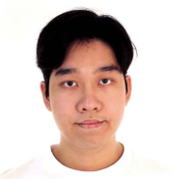

We are a team based in the [School of Computing, National University of Singapore](http://www.comp.nus.edu.sg).

You can reach us at the email `seer[at]comp.nus.edu.sg`

## Project team

### Ezra Tio

[[github](https://github.com/e1010101)]]
[[portfolio](team/e1010101.md)]

* Role: Team Lead, UI/UX, Feature Developer
* Responsibilities: X

### Gregg Chan

[[github](http://github.com/Hoodineee)]]
[[portfolio](team/Hoodineee.md)]

* Role: Scheduling and Tracking, Feature Developer
* Responsibilities: X

### Jonathan Goh

[[github](http://github.com/jgyj123)]]
[[portfolio](team/jgyj123.md)]

* Role: Component XYZ, Deliverables and Deadlines, Feature Developer
* Responsibilities: X

### Soo Jia Xi

[[github](http://github.com/joosxi)]]
[[portfolio](team/joosxi.md)]

* Role: Documentation, Feature Developer
* Responsibilities: X

### Xiao Ying

[[github](http://github.com/xiaoying1129)]]
[[portfolio](team/xiaoying1129.md)]

* Role: Component XYZ, Feature Developer
* Responsibilities: X
