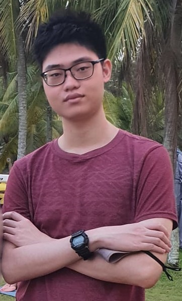
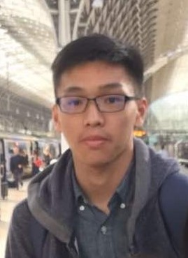
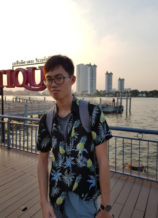
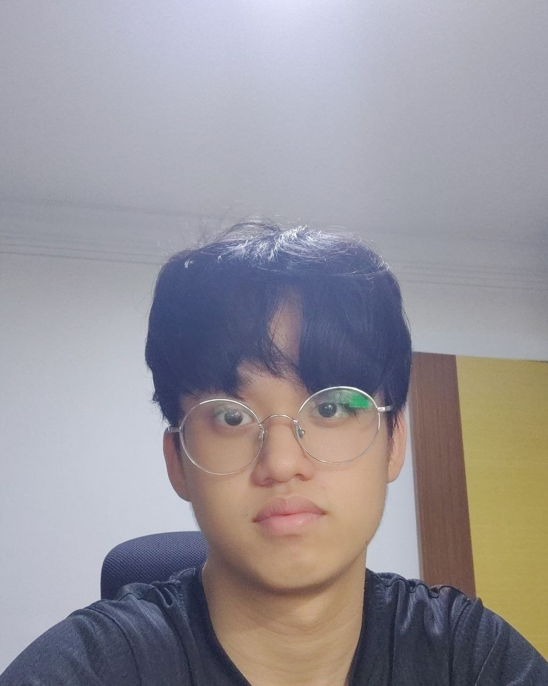

We are a team based in the [School of Computing, National University of Singapore](http://www.comp.nus.edu.sg).

## Project team

### Tan Jin Waye

[[github](https://github.com/Tan-Jin-Waye)]
[[portfolio](team/tan-jin-waye.md)]

* Role: Developer
* Responsibilities: Logic, Storage, DG Documentation

### Lian Guo Yang

[[github](http://github.com/LianGuoYang)]
[[portfolio](team/lianguoyang.md)]

* Role: Developer
* Responsibilities: Logic, Storage

### Cedric Chia

[[github](http://github.com/CedricChia123)]
[[portfolio](team/cedricchia123.md)]

* Role: Developer
* Responsibilities: Integration, Documentation

### Aloysius Neo

[[github](http://github.com/Aloynz)]
[[portfolio](team/aloynz.md)]

* Role: Developer
* Responsibilities: UI

### Lee Zi Yang

[[github](http://github.com/zylee348)]
[[portfolio](team/zylee348.md)]

* Role: Developer
* Responsibilities: UI
