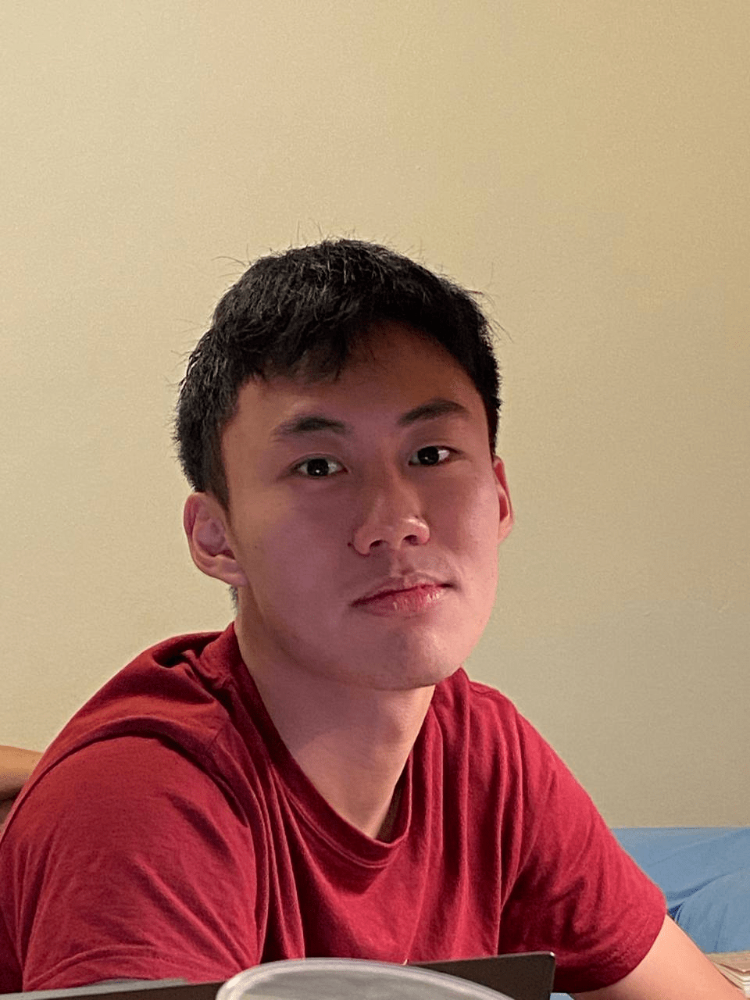
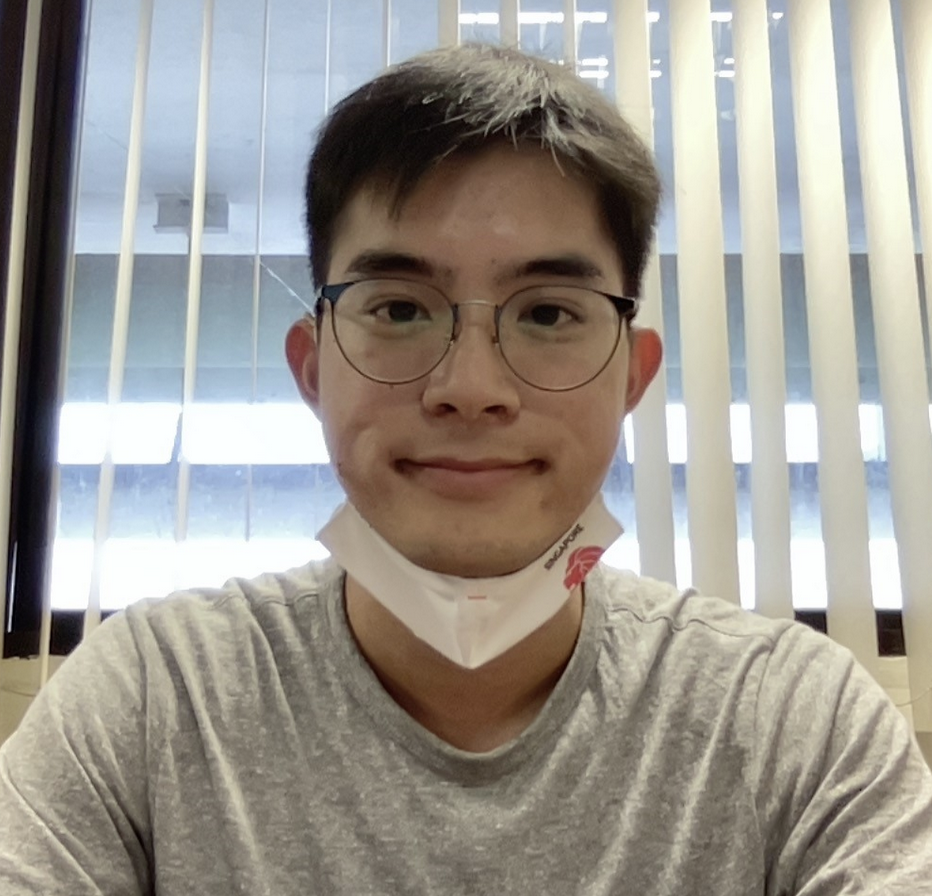
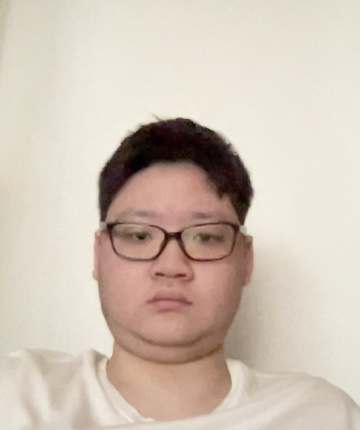

We are a team based in the [School of Computing, National University of Singapore](http://www.comp.nus.edu.sg).

You can reach us at the email `seer[at]comp.nus.edu.sg`

## CodeConnect

### Song Ivan

[[github](https://github.com/songivan00)]
[[portfolio](team/songivan00.md)]

* Role: Developer
* Responsibilities: Listing/sorting tasks and contacts features

### Denzel Tan

[[github](http://github.com/danzzzerl)]
[[portfolio](team/danzzzerl.md)]

* Role: Developer
* Responsibilities: finding tasks/contacts

### Jonathan Lam

[[github](http://github.com/JonLamy)]
[[portfolio](team/jonlamy.md)]

* Role: Developer
* Responsibilities: Storage and Data Management

### Poomklao Teerawatthanaprapha

[[github](http://github.com/parnikkapore)]
[[portfolio](team/parnikkapore.md)]

* Role: Integration, CI expert
* Responsibilities: adding/deleting/marking/unmarking tasks

### Ang Kuang Long

[[github](http://github.com/angkl0)]
[[portfolio](team/angkl0.md)]

* Role: Developer
* Responsibilities: Adding, deleting, editing and tagging contacts
