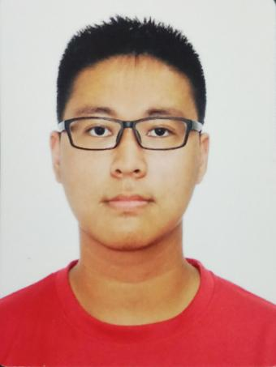
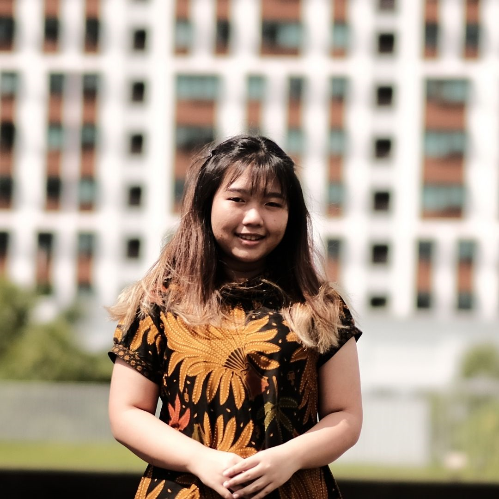
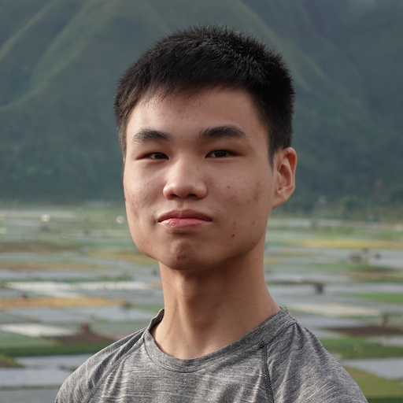
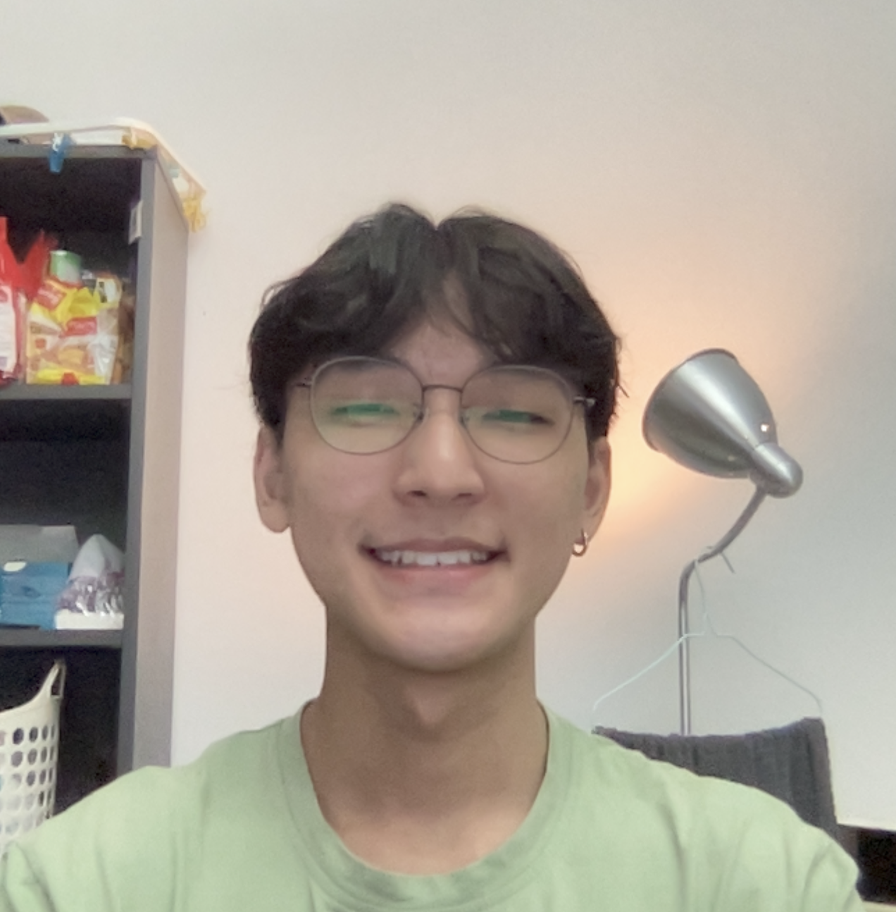
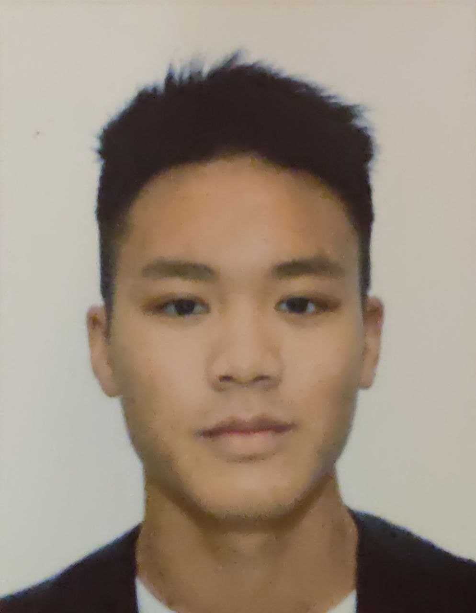

We are a team based in the [School of Computing, National University of Singapore](http://www.comp.nus.edu.sg).

You can reach us at the email `seer[at]comp.nus.edu.sg`

## Project team

uNivUSal

### Aaron Pang

[[github](https://github.com/turretDive)]
[[portfolio](team/turretdive.md)]

* Role: Project Advisor

### Livia Michelle

[[github](http://github.com/liviamil)]
[[portfolio](team/liviamil.md)]

* Role: Developer
* Responsibilities: UI

### Nicholas Patrick

[[github](http://github.com/NicholasPatrick)] [[portfolio](team/nicholaspatrick.md)]

* Role: Developer
* Responsibilities: Data

### Jun Sheng

[[github](http://github.com/jsincorporated)]
[[portfolio](team/jsincorporated.md)]

* Role: Developer
* Responsibilities: Dev Ops + Threading

### Julian Wong

[[github](http://github.com/Jnwkm)]
[[portfolio](team/jnwkm.md)]

* Role: Developer
* Responsibilities: UI
