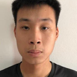
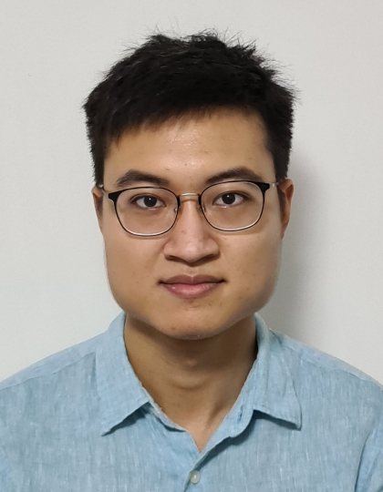
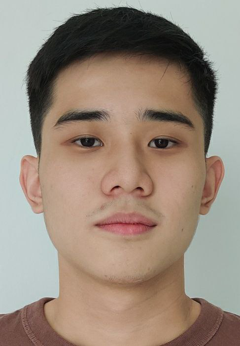
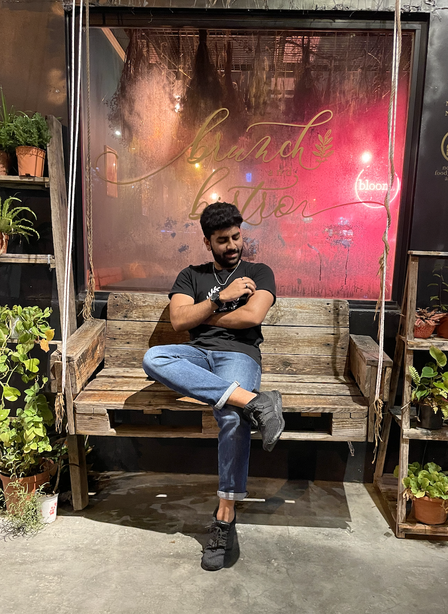
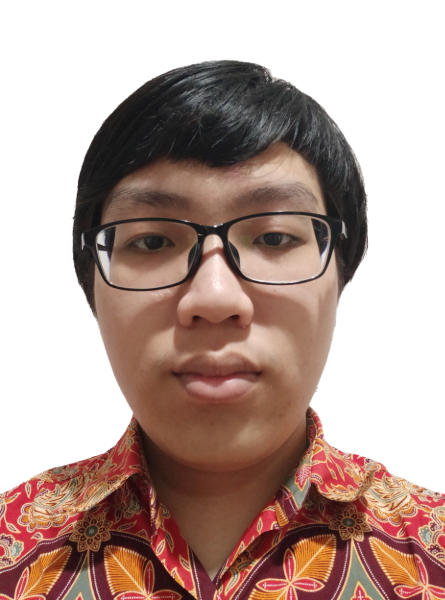

We are a team based in the [School of Computing, National University of Singapore](http://www.comp.nus.edu.sg).

You can reach us at the email `seer[at]comp.nus.edu.sg`

## Project team

### John Doe

[[homepage](http://www.comp.nus.edu.sg/~damithch)]
[[github](https://github.com/johndoe)]
[[portfolio](team/johndoe.md)]

* Role: Project Advisor

### Hau Chong

[[github](http://github.com/hauchongtang)]
[[portfolio](team/hauchontang.md)]

* Role: Developer
* Responsibilities: Scheduling and tracking, Integration

### Lee Kang Quan

[[github](https://github.com/Kang-Quan)] [[portfolio](team/kang-quan.md)] 

* Role: Developer
* Responsibilities: Testing, Code Quality

### Siau Wee

[[github](http://github.com/weesiau)]
[[portfolio](team/weesiau.md)]

* Role: Developer
* Responsibilities: Dev Ops + Threading

### Mohamed Hamas

[[github](http://github.com/Bahamas20)]
[[portfolio](team/bahamas20.md)]

* Role: Developer
* Responsibilities: UI

### Nathaniel Lukas Christianto

[github](https://github.com/dreammac3816547290)
[portfolio](docs/team/nathaniellukas.md)

* Role: Developer
* Responsibilities: Deliverables and deadlines