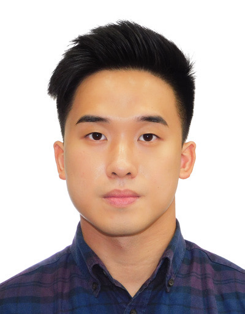
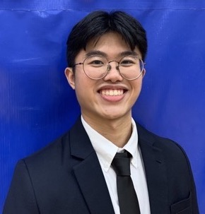
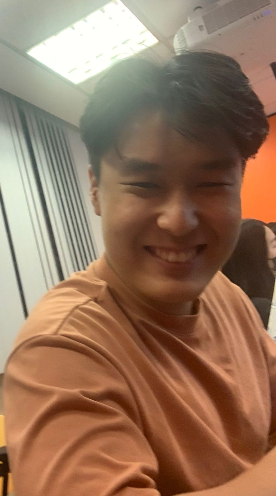

We are a team based in the [School of Computing, National University of Singapore](http://www.comp.nus.edu.sg).

You can reach us at the email `seer[at]comp.nus.edu.sg`

## Project team

### Elton Chua

[[homepage](http://www.comp.nus.edu.sg/~damithch)]
[[github](https://github.com/notle1706)]
[[portfolio](team/notle1706.md)]

* Role: Developer
* Responsibilities: 

### Jicson Toh

[[github](http://github.com/jicsontoh)]
[[portfolio](team/jicsontoh.md)]

* Role: Developer
* Responsibilities: Dev Ops

### Joel Wong

[[github](http://github.com/Jo3LW)] [[portfolio](team/jo3lw.md)]

* Role: Developer
* Responsibilities: Integration

### Jean Doe

[[github](http://github.com/johndoe)]
[[portfolio](team/jicsontoh.md)]

* Role: Developer
* Responsibilities: Dev Ops + Threading

### Nam Minh Quan

[[github](http://github.com/johndoe)]
[[portfolio](team/jicsontoh.md)]

* Role: Developer
* Responsibilities: UI

