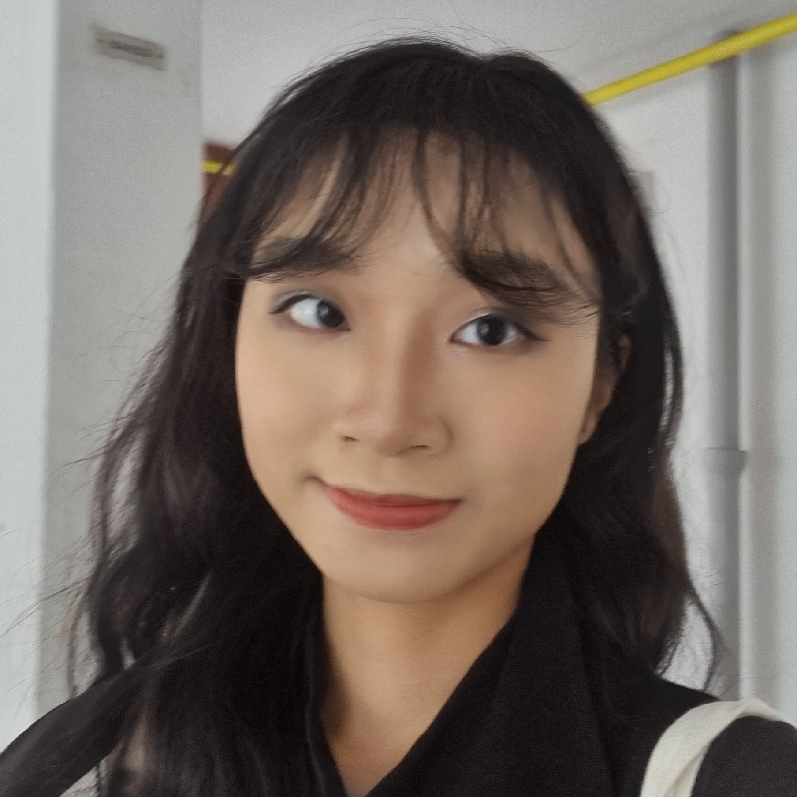
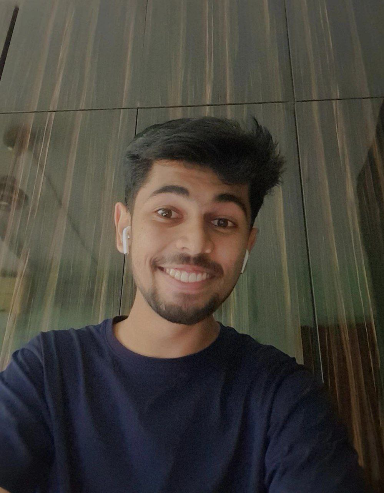
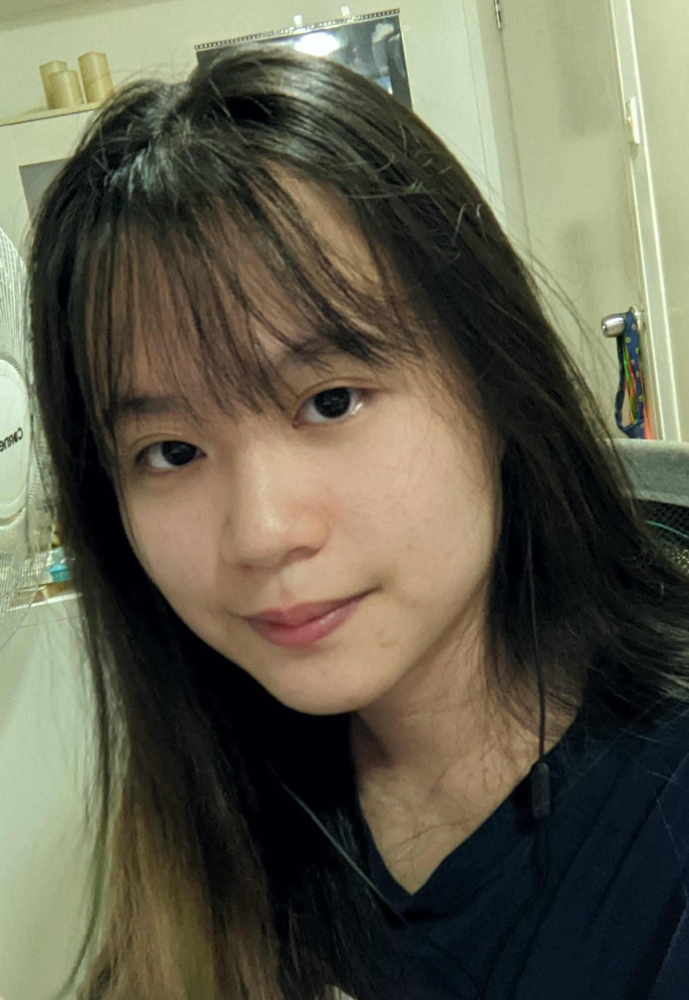
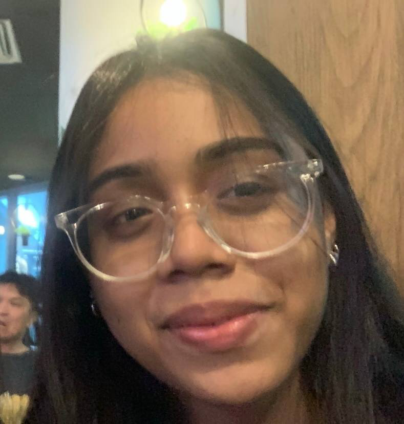
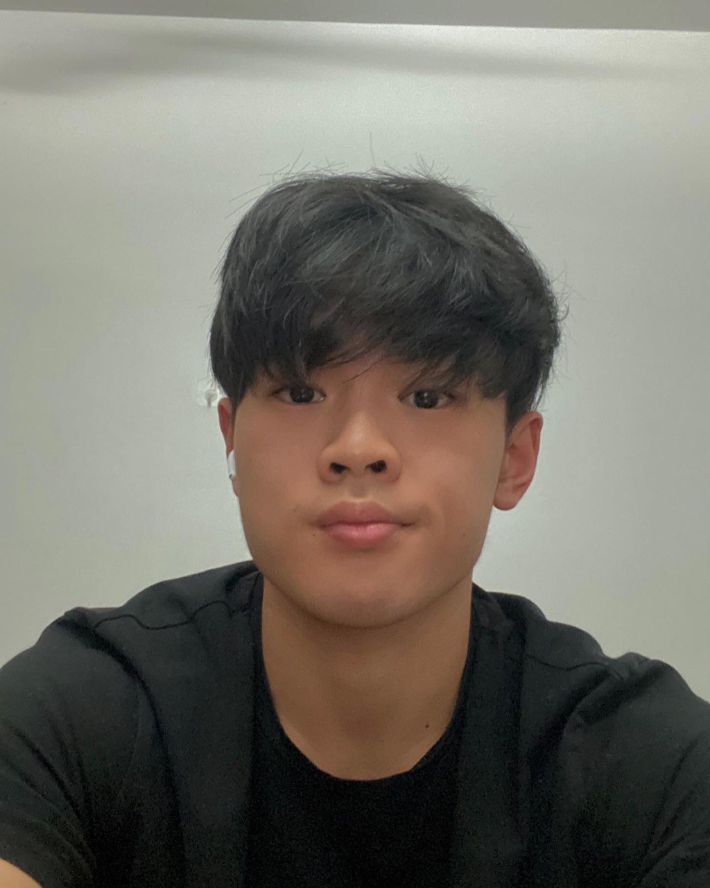

We are a team based in the [School of Computing, National University of Singapore](http://www.comp.nus.edu.sg).

## Project team

### Joanna Chan

[[github](http://github.com/cfyjoanna)]
[[portfolio](team/cfyjoanna.md)]

* Role: Team Lead
* Responsibilities: Integration

### Ashiqur Rahman

[[github](https://github.com/ashiqurrah)]
[[portfolio](team/ashiqurrah.md)]

* Role: Developer
* Responsibilities: Git expert

### Phylicia Christel

[[github](http://github.com/phyliciachristel)]
[[portfolio](team/phyliciachristel.md)]

* Role: Developer
* Responsibilities: Code Quality

### Farisa Nadia

[[github](http://github.com/farisanadia)]
[[portfolio](team/farisanadia.md)]

* Role: Developer
* Responsibilities: Documentation + Deliverables and deadlines

### Johannes

[[github](http://github.com/jwdavis0200)]
[[portfolio](team/jwdavis0200.md)]

* Role: Developer
* Responsibilities: Testing + Scheduling and tracking
