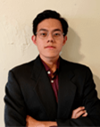
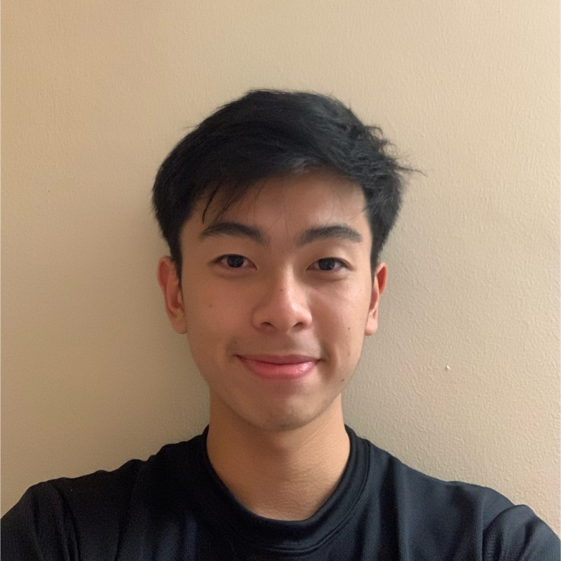
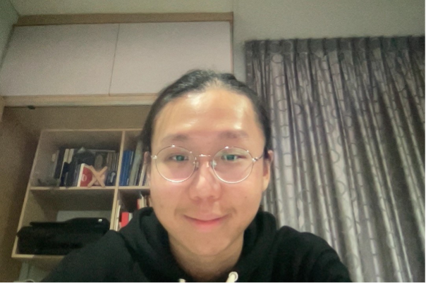
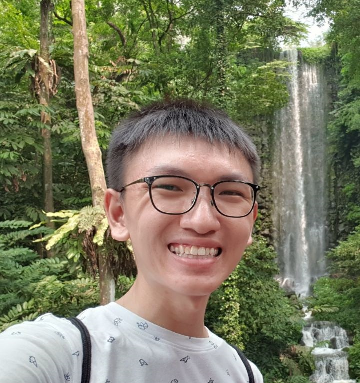
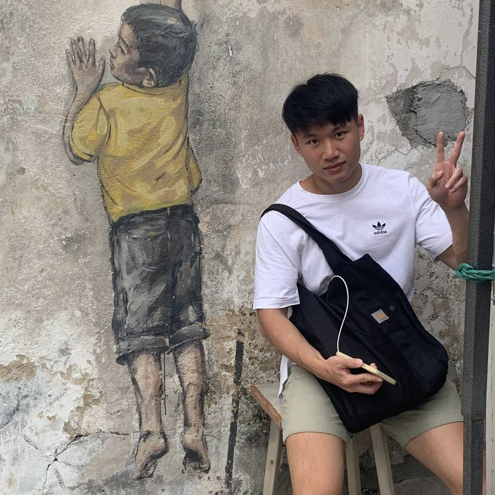

We are a team based in the [School of Computing, National University of Singapore](http://www.comp.nus.edu.sg).

You can reach us at the email `seer[at]comp.nus.edu.sg`

## Project team

### Gabriel Yang

[[github](https://github.com/gabyang)]
[[portfolio](team/johndoe.md)]

* Role: Project Advisor

### Paul Lee

[[github](http://github.com/paullee18)]
[[portfolio](team/johndoe.md)]

* Role: Team Lead
* Responsibilities: Model

### Daniel Lim

[[github](https://github.com/DanielLimWeiEn)] [[portfolio](team/johndoe.md)]

* Role: Developer 
* Responsibilities: Testing, Logic

### Yuan Wei

[[github](http://github.com/tyw2811)]
[[portfolio](team/johndoe.md)]

* Role: Developer
* Responsibilities: Documentation, Code Quality, Logic

### Edric Yeo

[[github](http://github.com/johndoe)]
[[portfolio](team/johndoe.md)]

* Role: Developer
* Responsibilities: Deliverables and Deadlines, Tracking and Scheduling, Storage
