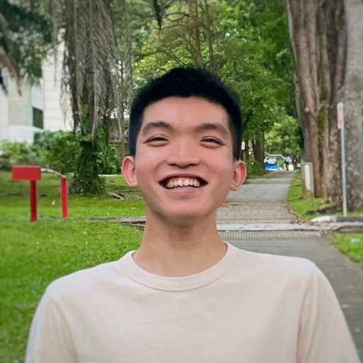
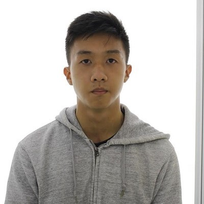
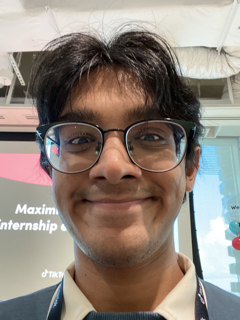

We are a team based in the [School of Computing, National University of Singapore](http://www.comp.nus.edu.sg).

You can reach us at the email `seer[at]comp.nus.edu.sg`

## Project team

### Vaishnav Muralidharan

[[github](https://github.com/johndoe)]

* Role: Project Advisor

### Tang Zhi Lin

[[github](http://github.com/Tex-Tang)]
[[portfolio](team/tex-tang.md)]

* Role: Developer
* Responsibilities: UI + Data

### Andrew Lo Zhi Sheng

[github](http://github.com/wrewsama) [portfolio](team/wrewsama.md)

* Role: Developer
* Responsibilities: UI

### Shan Hashir

[[github](http://github.com/sh4nH)]
[[portfolio](team/sh4nh.md)]

* Role: Developer
* Responsibilities: UI

### Arnav Aggarwal

[[github](http://github.com/arnav-ag)]
[[portfolio](team/arnav-ag.md)]

* Role: Developer
* Responsibilities: UI + API Integration
