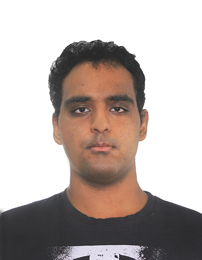
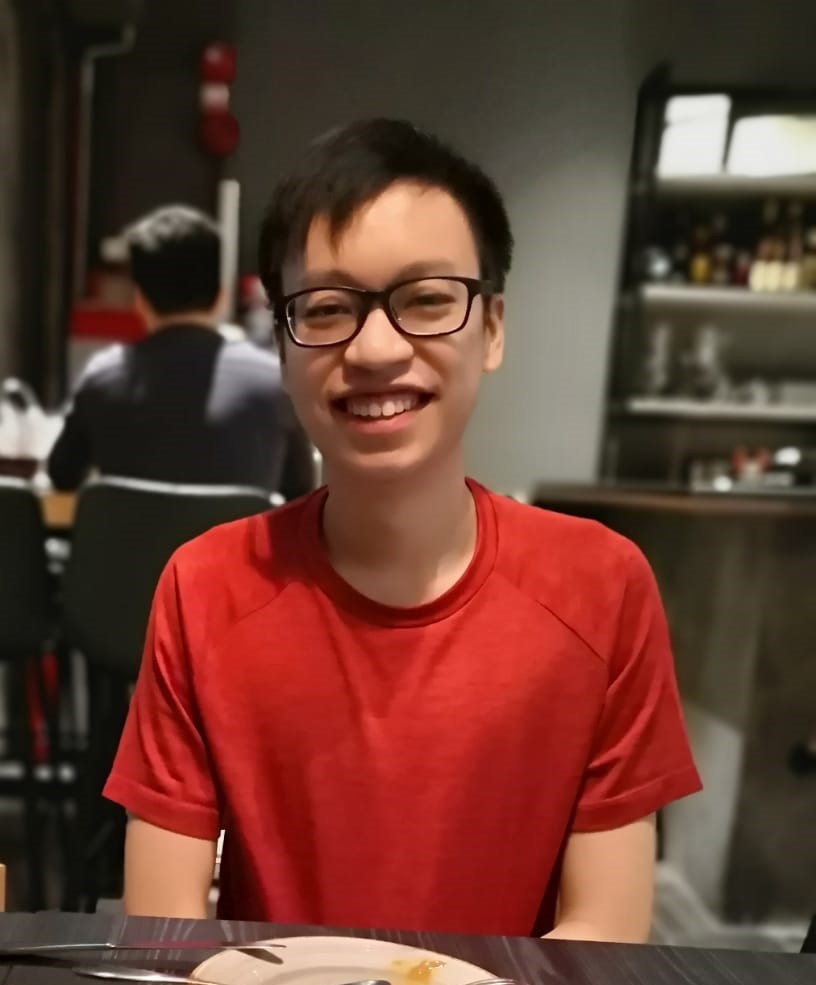
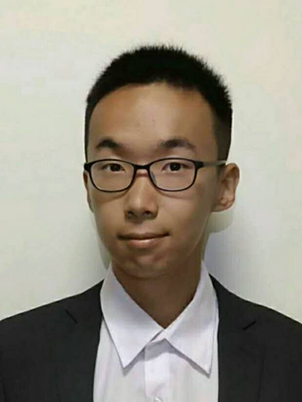
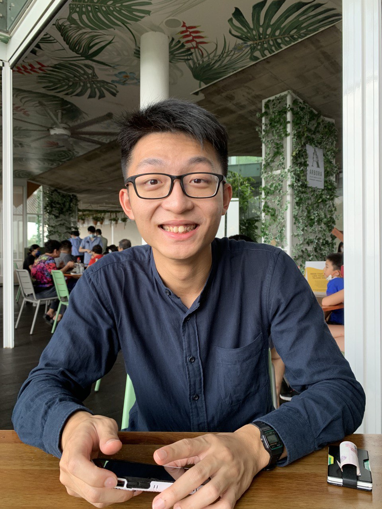
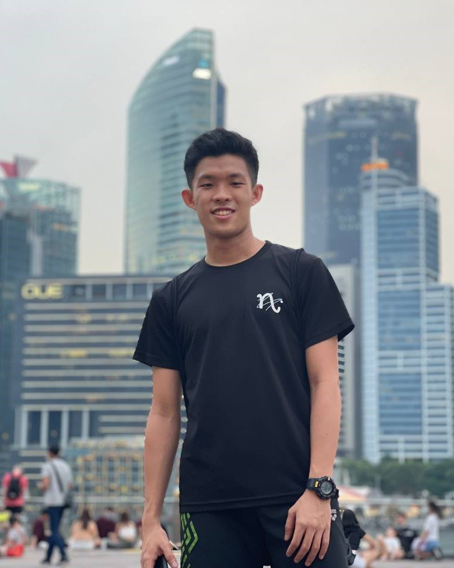

We are a team based in the [School of Computing, National University of Singapore](http://www.comp.nus.edu.sg).

You can reach us at the email `climods[at]comp.nus.edu.sg`

## Project team

### Huzaifa Raghav

[[github](https://github.com/huzaifa1712)]
[[portfolio](team/huzaifa1712.md)]

* Role: Developer
* Responsibilities: 

### Linus Lee

[[github](http://github.com/zupey)]
[[portfolio](team/zupey.md)]

* Role: Developer
* Responsibilities: Coder

### Pei Cheng Yi  

[[github](http://github.com/SeekSaveServe)] [[portfolio](team/seeksaveserve.md)]

* Role: Developer
* Responsibilities: Data

### Shen Yi Hong

[[github](http://github.com/shenyih0ng)]
[[portfolio](team/shenyih0ng.md)]

* Role: Developer
* Responsibilities:

### Chew Hong Jin

[[github](https://github.com/sarrrdin)]
[[portfolio](team/sarrrdin.md)]

* Role: Developer
* Responsibilities: UX
