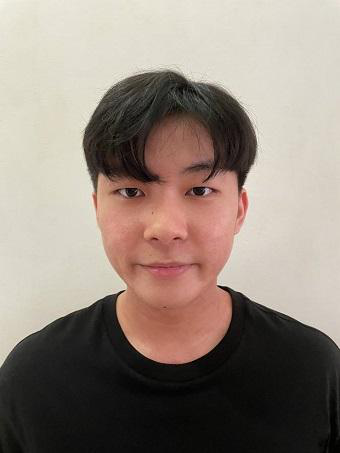
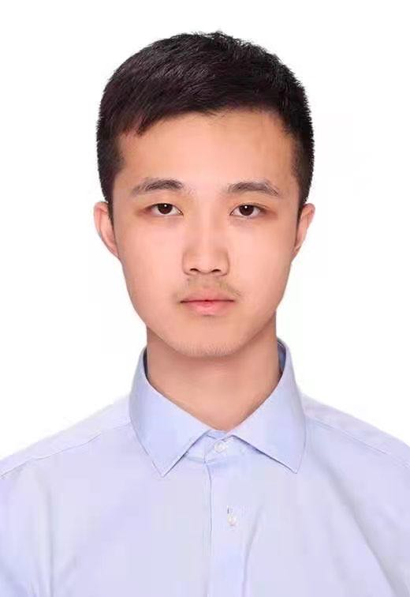
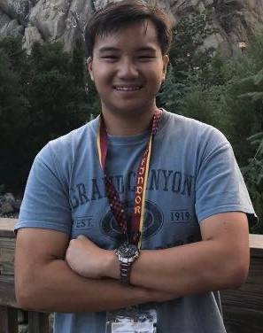

We are a team based in the [School of Computing, National University of Singapore](http://www.comp.nus.edu.sg).

You can reach us at the email `seer[at]comp.nus.edu.sg`

## Project team

### Bryan Ng Zi Hao

[[github](https://github.com/bryanngzh)]
[[portfolio](team/bryanngzh.md)]

* Role: Developer

### Li Zekai

[[github](https://github.com/lizekai-richard)]
[[portfolio](team/lizekai-richard.md)]

* Role: Developer
* Responsibilities: Backend

### Leong Jia Hao Daniel

[[github](http://github.com/leongdl135)] [[portfolio](team/leongdl135.md)]

* Role: Developer
* Responsibilities: Data

### Khoo Jing Hong, Derrick

[[github](http://github.com/drkkjh)]
[[portfolio](team/drkkjh.md)]

* Role: Developer
* Responsibilities: Dev Ops + Threading

### YANG Mingyang

[[github](http://github.com/myangat0343)]
[[portfolio](team/myangat0343.md)]

* Role: Developer
* Responsibilities: UI
