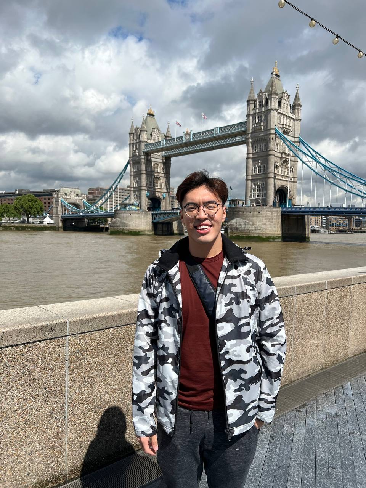
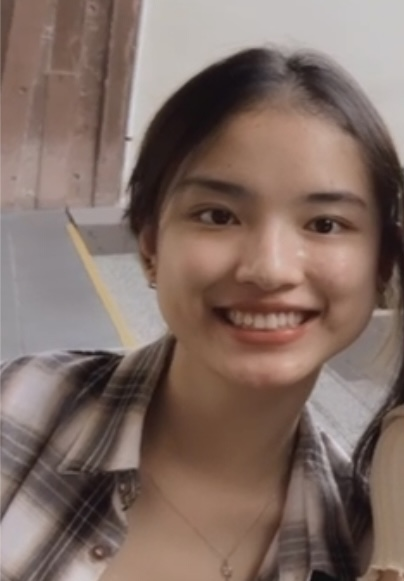
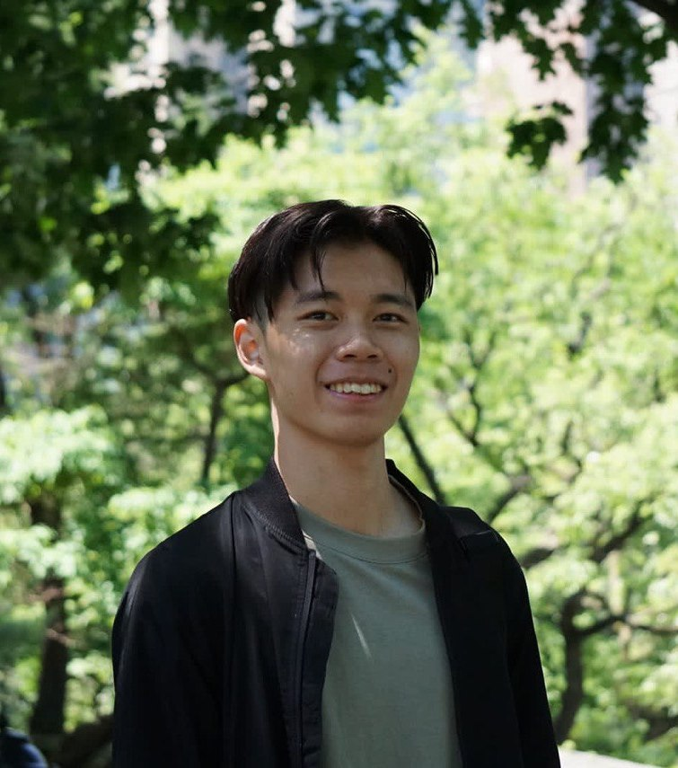

We are a team based in the [School of Computing, National University of Singapore](http://www.comp.nus.edu.sg).

You can reach us at the email `seer[at]comp.nus.edu.sg`

## Project team

### Shawn

[[github](https://github.com/snigloo)]
[[portfolio](team/snigloo.md)]

* Role: Team Lead
* Responsibilities: UI/UX

### Lin Leyi

[[github](http://github.com/lleyi0606)]
[[portfolio](team/lleyi0606.md)]

* Role: Documentation
* Responsibilities: Documentation

### Fang Yiye

[[github](http://github.com/yiyefyy)] [[portfolio](team/yiyefyy.md)]

* Role: Testing
* Responsibilities: Data

### Shawn Lee

[[github](http://github.com/xenonshawn)]
[[portfolio](team/xenonshawn.md)]

* Role: Developer
* Responsibilities: Code Quality

### Asher Lim

[[github](http://github.com/doimoiboi)]
[[portfolio](team/doimoiboi.md)]

* Role: Deliverables and Deadlines
* Responsibilities: Ensure project deliverables are done on time.
