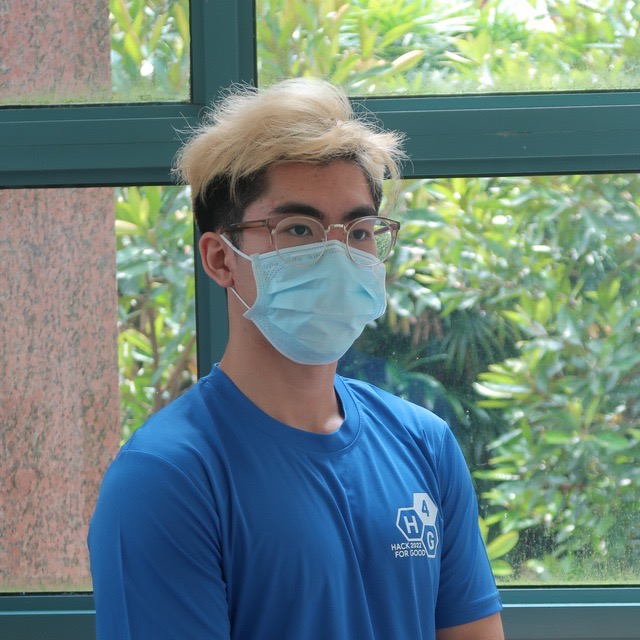

We are a team based in the [School of Computing, National University of Singapore](http://www.comp.nus.edu.sg).

You can reach us at the email `seer[at]comp.nus.edu.sg`

## Project team

### Shum Jie Hui

[[homepage]()]
[[github](https://github.com/ShummyOwnzYou)]
[[portfolio](team/jiehui.md)]

* Role: Project Advisor

### Samuel Cheong

[[github](https://github.com/samuelcheongws/)]
[[portfolio](team/samuelcheonws.md)]

* Role: Team Member
* Responsibilities: UI

### Liu Yijun

[[github](http://github.com/L1uY1jun)] [[portfolio](team/johndoe.md)]

* Role: Developer
* Responsibilities: Data

### Darren Tng

[[github](https://github.com/DarrenCsAcc)]
[[portfolio](team/johndoe.md)]

* Role: Developer
* Responsibilities: Dev Ops + Threading

### Benjy Tan

[[github](https://github.com/benjytan45678)]
[[portfolio](team/johndoe.md)]

* Role: Developer
* Responsibilities: UI
