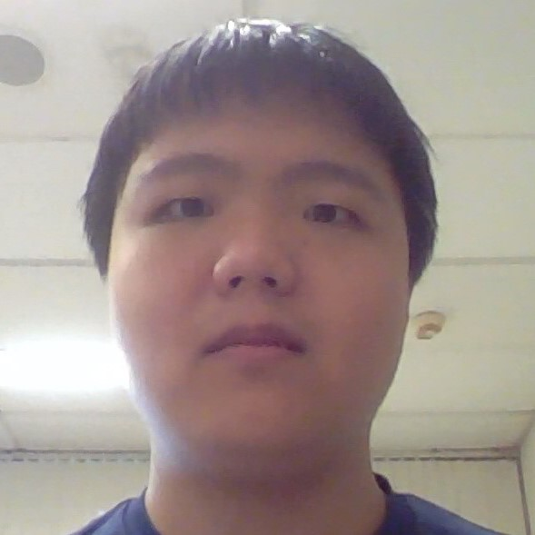
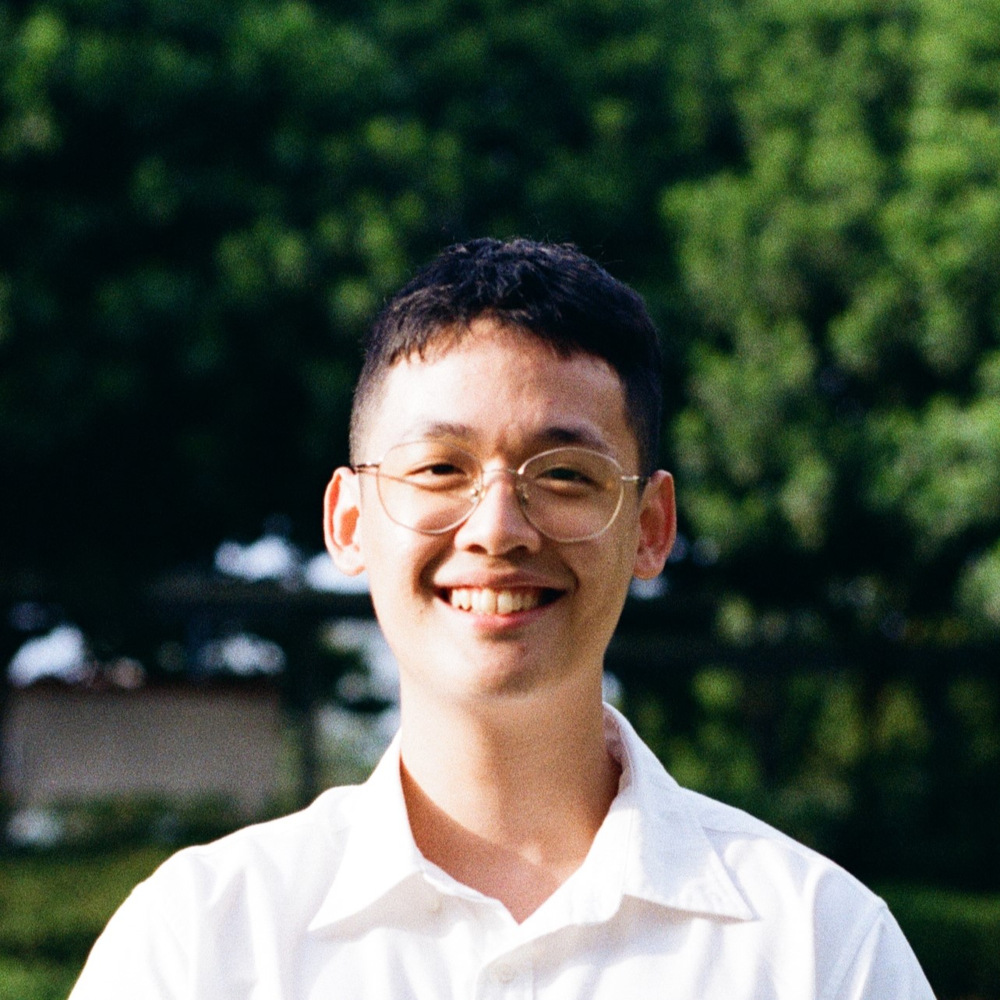

We are a team based in the [School of Computing, National University of Singapore](http://www.comp.nus.edu.sg).

You can reach us at the email `seer[at]comp.nus.edu.sg`

## Project team

### Sean Spencer Manik

[[github](http://github.com/seanmanik)] [[portfolio](team/seanmanik.md)]

* Role: Team Lead
* Responsibilities: UI

### Su Peigeng

[[github](http://github.com/bacon-strips)] [[portfolio](team/bacon-strips.md)]

* Role: Developer
* Responsibilities: Data

### Stevan Gerard Gunawan

[[github](http://github.com/gerardstevan)]
[[portfolio](team/gerardstevan.md)]

* Role: Developer
* Responsibilities: Dev Ops + Threading

### Ling Guan Ming

[[github](http://github.com/ceereec)]
[[portfolio](team/ceereec.md)]

* Role: Developer
* Responsibilities: UI

### Cheng Jun Tey

[[github](http://github.com/cjun1039)]
[[portfolio](team/cjun1039.md)]

* Role: Developer
* Responsibilities: Dev Ops
