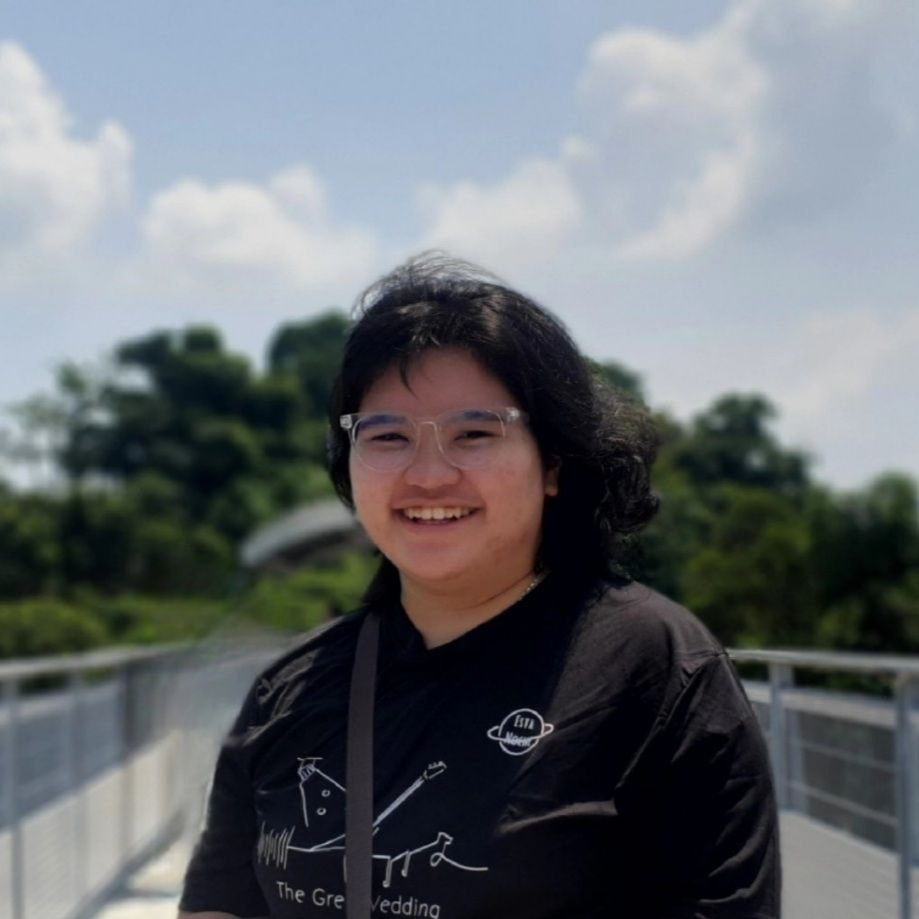

We are a team based in the [School of Computing, National University of Singapore](http://www.comp.nus.edu.sg).

You can reach us at the email `seer[at]comp.nus.edu.sg`

## Project team

### Tiang Hui Zheng

[[github](https://github.com/heyzec)]
[[portfolio](team/heyzec.md)]

* Role: Team Lead

### Yeo Yu Jie

[[github](https://github.com/yeoyujie)]
[[portfolio](team/yeoyujie.md)]

* Role: Integration, Scheduling and Tracking

### Nguyen Doan Phuong Anh

[[github](https://github.com/april-anh)]
[[portfolio](team/april-anh.md)]

* Role: Deliverables and Deadlines

### Johnny Doe

[[github](http://github.com/johndoe)] [[portfolio](team/johndoe.md)]

* Role: Developer
* Responsibilities: Data

### Jean Doe

[[github](http://github.com/johndoe)]
[[portfolio](team/johndoe.md)]

* Role: Developer
* Responsibilities: Dev Ops + Threading

### James Doe

[[github](http://github.com/johndoe)]
[[portfolio](team/johndoe.md)]

* Role: Developer
* Responsibilities: UI
