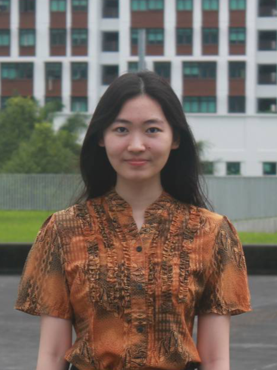

We are a team based in the [School of Computing, National University of Singapore](http://www.comp.nus.edu.sg).

You can reach us via [GitHub Issues](https://github.com/AY2223S1-CS2103T-W15-1/tp/issues).

## Project team

### Eugene Ong Wei Xiang

[[github](https://github.com/eugene-ong-w-x)]
[[portfolio](team/eugene-ong-w-x.md)]

* Role: Team Lead
* Responsibilities: Overall project coordination, deliverables, scheduling and tracking

### Florentiana Yuwono

[[github](http://github.com/florentianayuwono)] [[portfolio](team/florentianayuwono.md)]

* Role: Developer
* Responsibilities: Documentation

### Chong Chee Kai, Clarence

[[github](http://github.com/chongcheekaiclarence)]
[[portfolio](team/chongcheekaiclarence.md)]

* Role: Developer
* Responsibilities: Integration

### Pang Kuang Wei

[[github](http://github.com/pangkuangwei)]
[[portfolio](team/pangkuangwei.md)]

* Role: Developer
* Responsibilities: Testing

### Wu Changjun

[[github](http://github.com/ugholaf)]
[[portfolio](team/ugholaf.md)]

* Role: Developer
* Responsibilities: Code Quality
