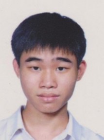

We are a team based in the [School of Computing, National University of Singapore](http://www.comp.nus.edu.sg).

You can reach us at the email `seer[at]comp.nus.edu.sg`

## Project team

### Lee I-Shiuan

[[github](http://github.com/ish1506)]
[[portfolio](team/ish1506.md)]

* Role: Developer
* Responsibilities: UI

### Tan Xuan Yun

[[github](http://github.com/tanxuanyun)]
[[portfolio](team/tanxuanyun.md)]

* Role: Developer
* Responsibilities: 
  * Integration of components 
  * In-charge of logic component 

### Lee Cheng Da

[[github](http://github.com/chengda300)] [[portfolio](team/chengda300.md)]

* Role: Developer
* Responsibilities: Feature enhancements

### Liu Fangrui

[[github](http://github.com/liufangrui)]
[[portfolio](team/liufangrui.md)]

* Role: `to be added soon`
* Responsibilities: `to be added soon`

### Ng Qi Ting

[[github](http://github.com/nqt230)]
[[portfolio](team/nqt230.md)]

* Role: Developer
* Responsibilities: UI
