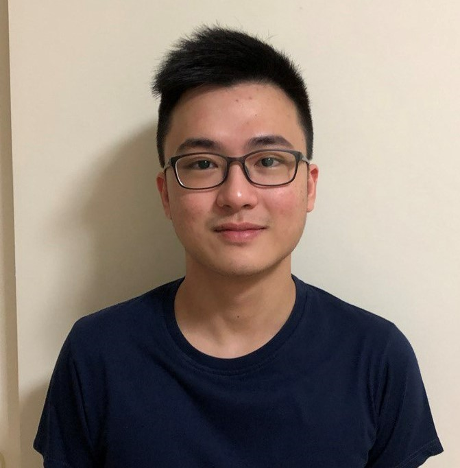

We are a team based in the [School of Computing, National University of Singapore](http://www.comp.nus.edu.sg).

You can reach us at the email `seer[at]comp.nus.edu.sg`

## Project team

### Hong Sheng

[[github](http://github.com/loyhongshenggg)]
[[portfolio](team/loyhongshenggg.md)]

* Role: Team Lead and Developer
* Responsibilities: Team Coordination, UI/UX of LTNS, Wireframing/Figma diagram, Main reviewer for Damien
* In-charge of features: Ui, LTNS main UI/UX, pin, viewPin and viewIncome

### Damien Koh

[[github](http://github.com/ssatu)]
[[portfolio](team/ssatu.md)]

* Role: Developer
* Responsibilities: Documentation, Testing, Deliverables and deadlines, Main reviewer for Colin
* In-charge of features: Policy management

### Reuben Chay

[[github](https://github.com/ReubenChay)]
[[portfolio](team/reubenchay.md)]

* Role: Developer
* Responsibilities: Scheduling and tracking, code quality, Main reviewer for Hong Sheng
* In-charge of features: sort

### Colin Toh

[[github](http://github.com/cowlinn)]
[[portfolio](team/cowlinn.md)]

* Role: Developer
* Responsibilities:Integration, Testing, Main Reviewer for Marcus
* In-Charge of Features: Client Class Management

### Marcus Chua

[[github](https://github.com/marcusczh)]
[[portfolio](team/marcusczh.md)]

* Role: Developer
* Responsibilities: Code quality, integration, Main reviewer for Reuben
* In-charge of features: findClient, findPolicy, findEvent

