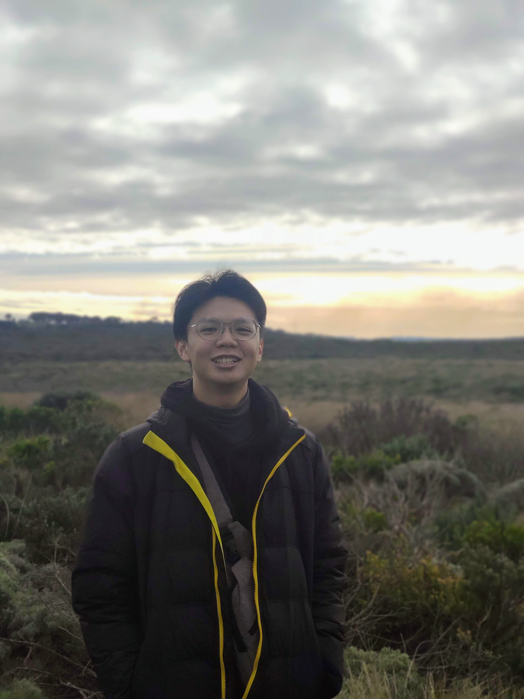

We are a team based in the [School of Computing, National University of Singapore](http://www.comp.nus.edu.sg).

You can reach us at the email `seer[at]comp.nus.edu.sg`

## Project team

### Linus Chan

[[github](https://github.com/linuschancs)]
[[portfolio](team/linuschancs.md)]

* Role: Team Lead / Developer
* Responsibilities: Deliverables and Scheduling

### Chia Min Jiun

[[github](http://github.com/minjiunn)]
[[portfolio](team/minjiunn.md)]

* Role: Developer
* Responsibilities: Testing

### Jerome Pui

[[github](http://github.com/jeromepui)]
[[portfolio](team/jeromepui.md)]

* Role: Developer
* Responsibilities: Documentation

### Daniel Kok

[[github](https://github.com/danielk0k)]
[[portfolio](team/danielk0k.md)]

* Role: Developer
* Responsibilities: Integration

### Max Tan

[[github](https://github.com/maxtance/)]
[[portfolio](team/maxtance.md)]

* Role: Developer
* Responsibilities: Code Quality
