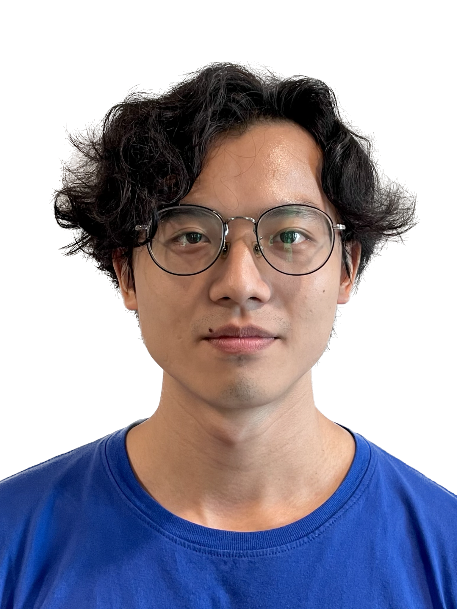
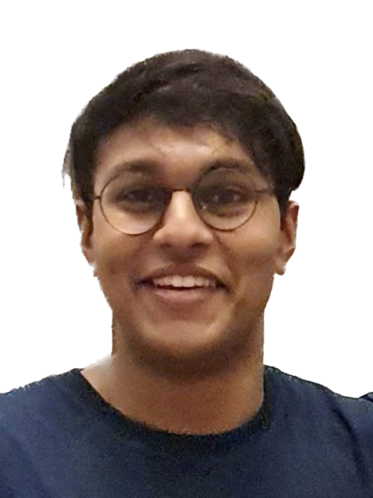

We are a team based in the [School of Computing, National University of Singapore](http://www.comp.nus.edu.sg).

You can reach us at the email `seer[at]comp.nus.edu.sg`

## Project team

### Shawn Kok

[[github](https://github.com/Kok-je)]
[[portfolio](team/kok-je.md)]

- Role: Developer
- Responsibilities: Testing, Integration, Intellij expert, In charge of Model, UI, Storage

### Chao Yung

[[github](https://github.com/chao890)]
[[portfolio](team/chao890.md)]

- Role: Developer
- Responsibilities: Documentation, Git Expert

### Kevin Chang

[[github](http://github.com/kevinchangjk)]
[[portfolio](team/kevinchangjk.md)]

- Role: Developer
- Responsibilities: Backend, Code Quality

### Prittam Ravi

[[github](https://github.com/prit3010)]
[[portfolio](team/prit3010.md)]

- Role: Team Lead
- Responsibilities: Scheduling & Tracking, Deliverables & Deadlines

### Ng Shi Jun

[[github](http://github.com/ngshijun)]
[[portfolio](team/ngshijun.md)]

- Role: Developer
- Responsibilities: Frontend, UI

### James Doe

[[github](http://github.com/johndoe)]
[[portfolio](team/johndoe.md)]

- Role: Developer
- Responsibilities: UI
