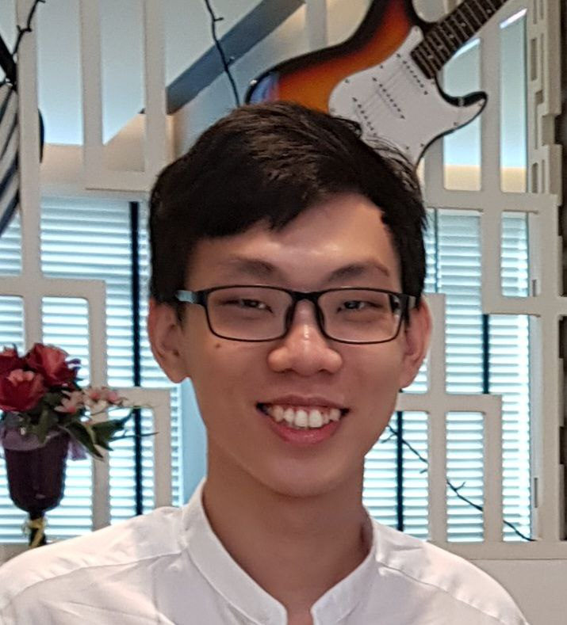

# About Us

We are a team based in the [School of Computing, National University of Singapore](http://www.comp.nus.edu.sg).
Our team followed an egoless team structure 

## Project team

### Kok Chun Khai

[[github](http://github.com/avock)]
[[portfolio](team/avock.md)]

* Role: Developer
* Responsibilities: UI, Application Logic, Testing, Documentation

### Xu Daofu

[[github](https://github.com/therealdaofu)]
[[portfolio](team/therealdaofu.md)]

* Role: Developer
* Responsibilities: Application Logic, Testing, Documentation

### Sun Yu Ting

[[github](http://github.com/effixion)]
[[portfolio](team/effixion.md)]

* Role: Developer
* Responsibilities: Application Logic, Testing, Documentation

### Li Yingming

[[github](http://github.com/Yingming23)]
[[portfolio](team/yingming23.md)]

* Role: Developer
* Responsibilities: Application Logic, Testing, Documentation

### Tin Jingyao

[[github](http://github.com/tin-jy)]
[[portfolio](team/tin-jy.md)]

* Role: Developer
* Responsibilities: Application Logic, Testing, Documentation
