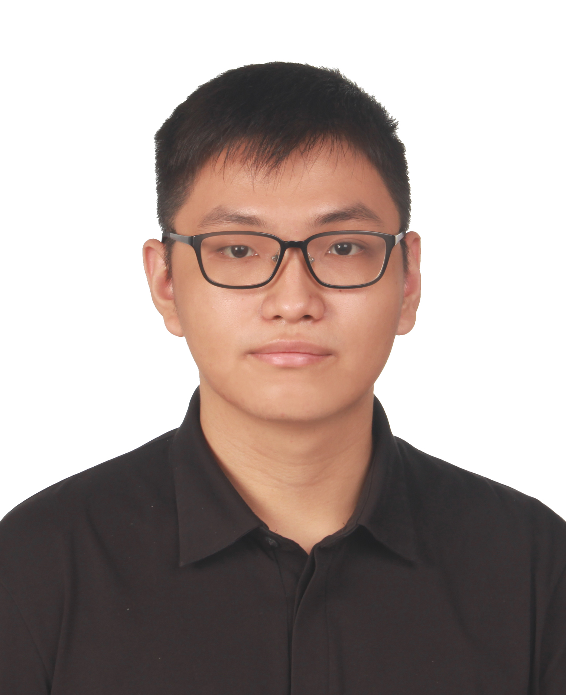
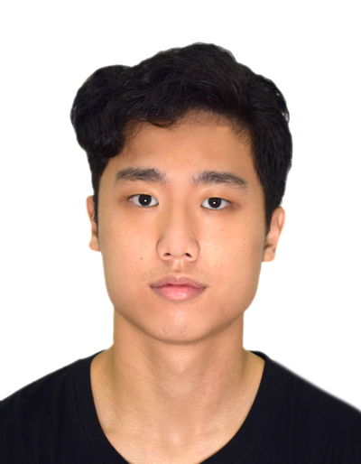
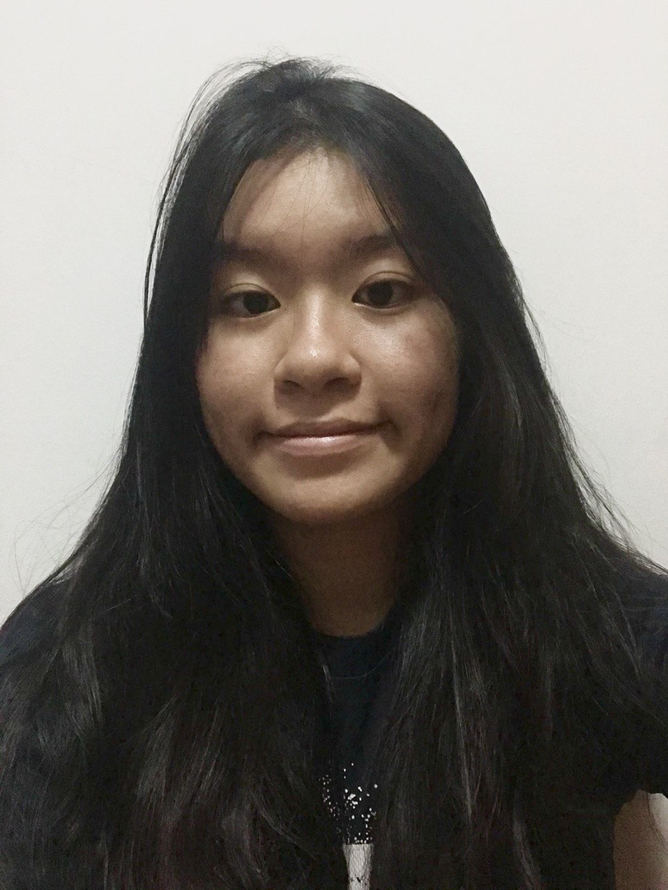

---
About Us
---

We are a team based in the [School of Computing, National University of Singapore](http://www.comp.nus.edu.sg).

You can reach us at the email `seer[at]comp.nus.edu.sg`

## Project team

### Zhang Bozheng

[[github](https://github.com/zbz-lvlv)]
[[portfolio](team/zbz-lvlv.md)]

* Role: Team Lead
* Responsibilities: All

### Kang Wenhan

[[github](http://github.com/onepersonhere)]
[[portfolio](team/onepersonhere.md)]

* Role: Chief Programmer
* Responsibilities: Backend

### Justin Cheng

[[github](http://github.com/Chustinjeng)] [[portfolio](team/Chustinjeng.md)]

* Role: Developer
* Responsibilities: Data

### Jean Doe

[[github](http://github.com/johndoe)]
[[portfolio](team/johndoe.md)]

* Role: Developer
* Responsibilities: Dev Ops + Threading

### Sheryl Kong

[[github](http://github.com/sherylkong18)]
[[portfolio](team/sherylkong18.md)]

* Role: Developer
* Responsibilities: UI
