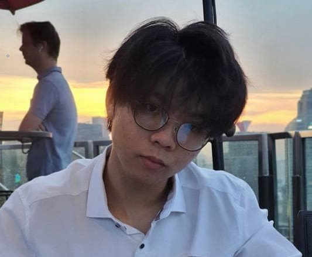

We are a team based in the [School of Computing, National University of Singapore](http://www.comp.nus.edu.sg).

You can reach us at the email `seer[at]comp.nus.edu.sg`

## Project team

### Clifton Felix

[[github](https://www.github.com/cliftonfelix)]
[[portfolio](team/cliftonfelix.md)]

* Role: Developer
* Responsibilities: Code, Testing, Documentation

### Daniel Lee

[[github](http://github.com/lulucopter)]
[[portfolio](team/lulucopter.md)]

* Role: Team Lead
* Responsibilities: Logic

### Deon Tan

[[github](http://github.com/deeyonn)]
[[portfolio](team/deeyonn.md)]

* Role: Developer
* Responsibilities: Testing & Integration

### Jason Ciu Putra Sung

[[github](http://github.com/jasoncp14)]
[[portfolio](team/jasoncp14.md)]

* Role: Developer
* Responsibilities: Code Quality, Testing, Documentation

### Jessica Mary Listijo

[[github](http://github.com/maryjess)]
[[portfolio](team/maryjess.md)]

* Role: Developer
* Responsibilities: UI, Documentation
