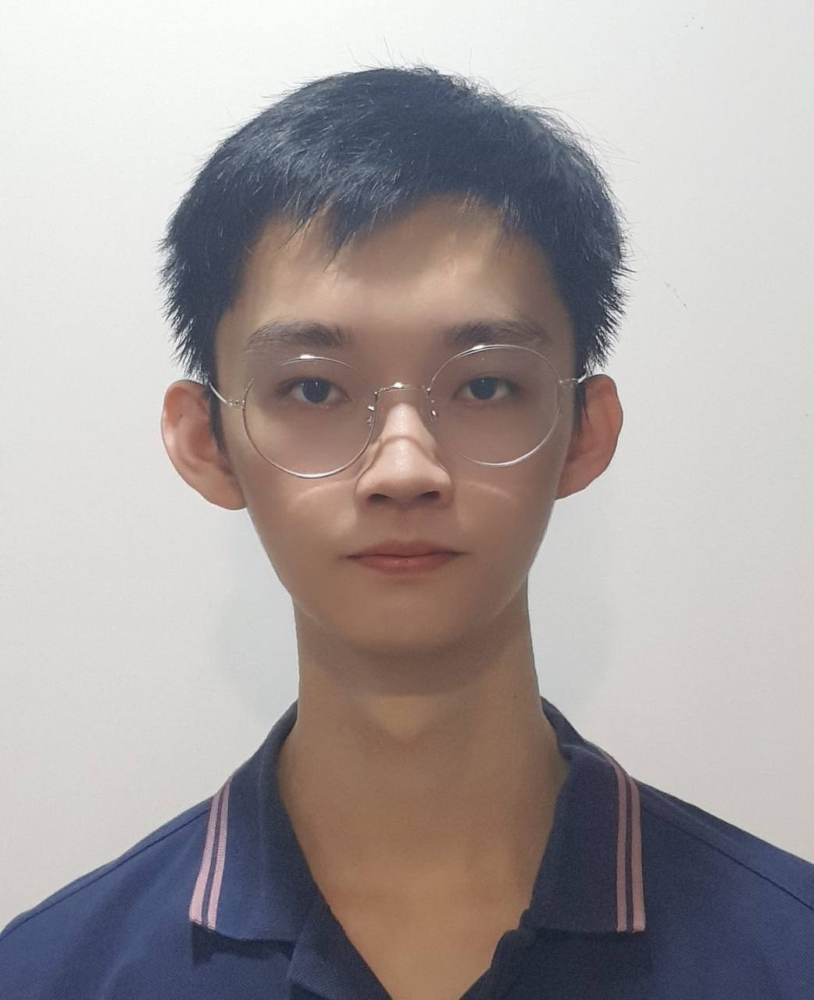
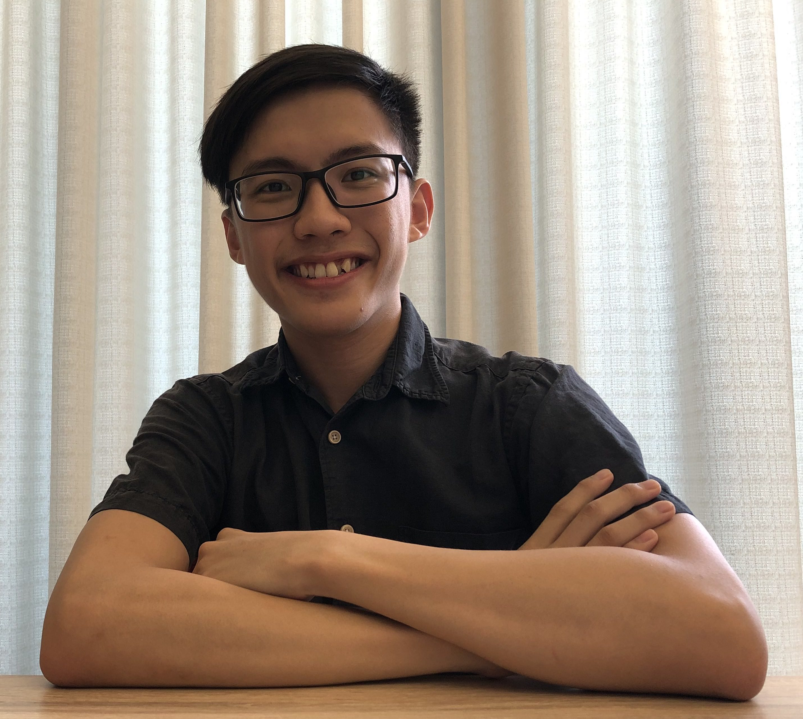

We are a team based in the [School of Computing, National University of Singapore](http://www.comp.nus.edu.sg).

You can reach us at the email `seer[at]comp.nus.edu.sg`

## Project team

### Bryan Lim Jing Xiang

[[github](https://github.com/bryanljx)]
[[portfolio](team/bryanljx.md)]

- Role: Project Member

### Richard Dominick

[[github](https://github.com/RichDom2185)]
[[portfolio](team/richdom2185.md)]

- Role: Project Member

### Tan Wei Lie Eugene

[[github](https://github.com/eugenetanwl3881)]
[[portfolio](team/eugenetanwl3881.md)]

- Role: Project Member

### Tan Yi Xian

[[github](https://github.com/yixiann)]

[[portfolio](team/yixiann.md)]

- Role: Secretary

### Johnny Doe

[[github](http://github.com/johndoe)] [[portfolio](team/johndoe.md)]

- Role: Developer
- Responsibilities: Data

### Jean Doe

[[github](http://github.com/johndoe)]
[[portfolio](team/johndoe.md)]

- Role: Developer
- Responsibilities: Dev Ops + Threading

### James Doe

[[github](http://github.com/johndoe)]
[[portfolio](team/johndoe.md)]

- Role: Developer
- Responsibilities: UI
