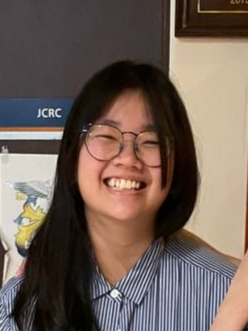

We are a team based in the [School of Computing, National University of Singapore](http://www.comp.nus.edu.sg).

## Project team

### Dilys Pang

[github](https://github.com/Dilysss)
[portfolio](team/dilysss.md)

* Role: Project Advisor
* Responsibilities: Student Functions

### Lim Qiao En

[github](http://github.com/qiaoen17)
[portfolio](team/qiaoen17.md)

* Role: Developer
* Responsibilities: UI

### Leong Yu Xuan

[github](http://github.com/yuxuanleong)
[portfolio](team/yuxuanleong.md)

* Role: Developer
* Responsibilities: Data

### Yang Xiang

[github](http://github.com/shawn532)
[portfolio](team/shawn532.md)

* Role: Developer
* Responsibilities: Dev Ops + Threading

### Tan Cheong Hsien Ryan

[github](https://github.com/ketamethane)
[portfolio](team/ketamethane.md)

* Role: Developer
* Responsibilities: Question Class
