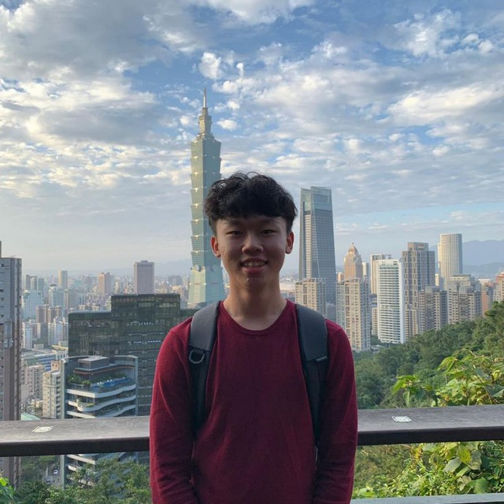
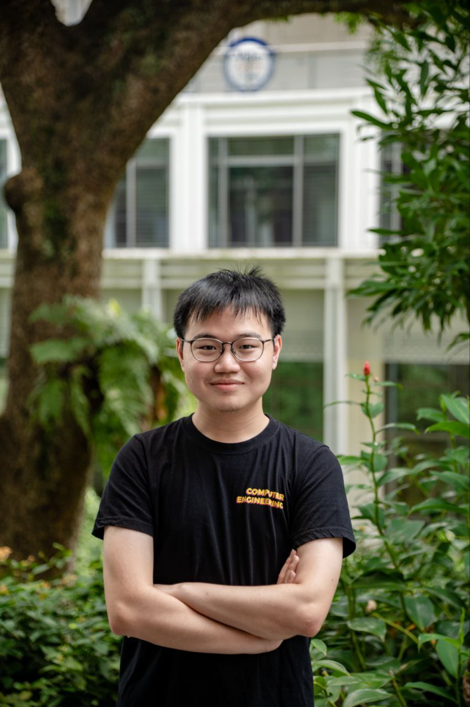

We are a team based in the [School of Computing, National University of Singapore](http://www.comp.nus.edu.sg).

You can reach us at the email `seer[at]comp.nus.edu.sg`

## Project team

### Tan Jing Jie

[[github](https://github.com/jjtan444)]
[[portfolio](team/jjtan444.md)]

* Role: Developer
* Responsibilities: Deliverables and deadlines

### Darren Wah

[[github](http://github.com/Darren12345677)]
[[portfolio](team/darren12345677.md)]

* Role: Developer
* Responsibilities: Integration, Scheduling and tracking

### Ng Yee Thern

[[github](http://github.com/AugustDespair)] [[portfolio](team/augustdespair.md)]

* Role: Code Quality
* Responsibilities: Code Quality

### Renee Yeow

[[github](http://github.com/reneeyeow02)]
[[portfolio](team/johndoe.md)]

* Role: UI Designer
* Responsibilities: UI and Documentation

### Ng Jia Le Max

[[github](http://github.com/maxng17)]
[[portfolio](team/maxng17.md)]

* Role: Developer
* Responsibilities: Documentation
