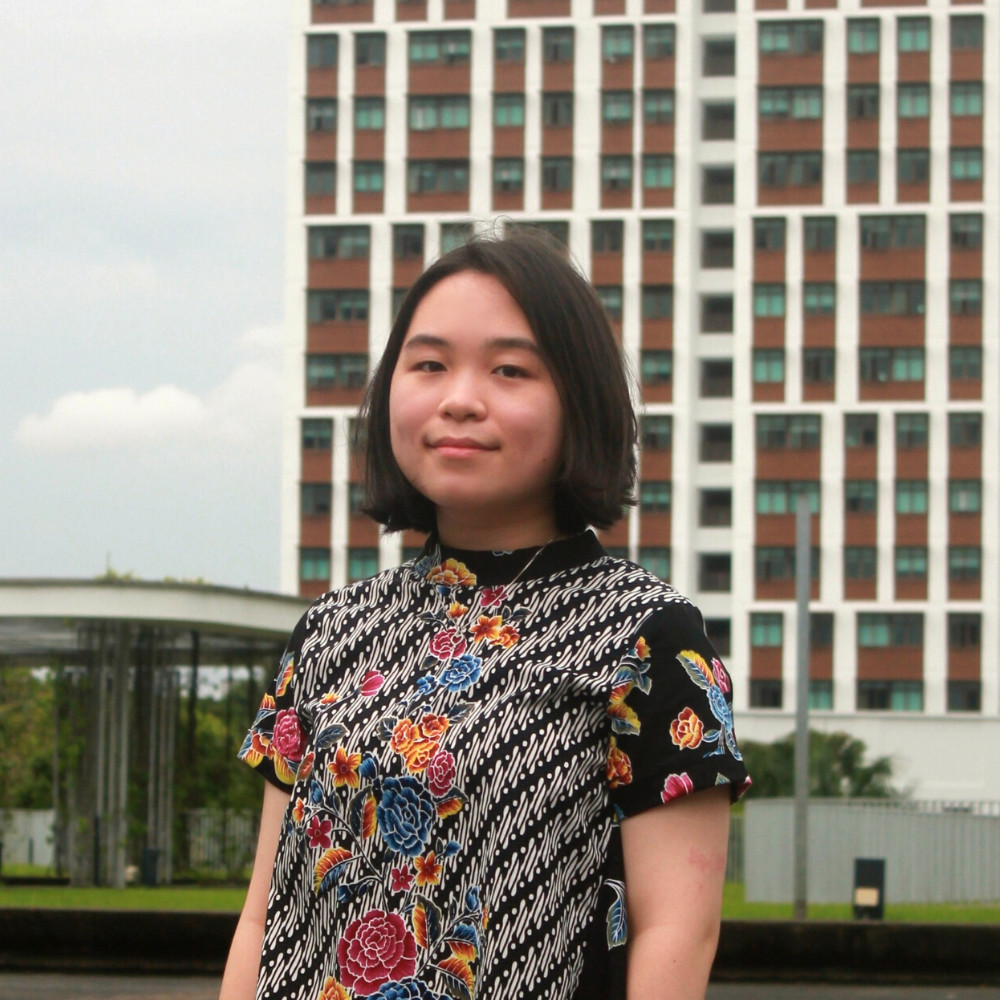

We are a team based in the [School of Computing, National University of Singapore](http://www.comp.nus.edu.sg).

You can reach us at the email `seer[at]comp.nus.edu.sg`

## Project team

### Lim Jun Hong, Don

[[github](https://github.com/donljh)]
[[portfolio](team/donljh.md)]

* Role: Project Advisor

### Jane Doe

[[github](http://github.com/donljh)]
[[portfolio](team/johndoe.md)]

* Role: Team Lead
* Responsibilities: UI

### Melissa Harijanto

[[github](http://github.com/melissaharijanto)] [[portfolio](team/johndoe.md)]

* Role: Developer
* Responsibilities: Data

### Janelle Loh Jen Teng

[[github](http://github.com/janelleljt)]
[[portfolio](team/johndoe.md)]

- Role: Developer
- Responsibilities: Dev Ops + Threading

### Soh Enze

[[github](http://github.com/sohenze)]
[[portfolio](team/sohenze.md)]

- Role: Developer
- Responsibilities: 
