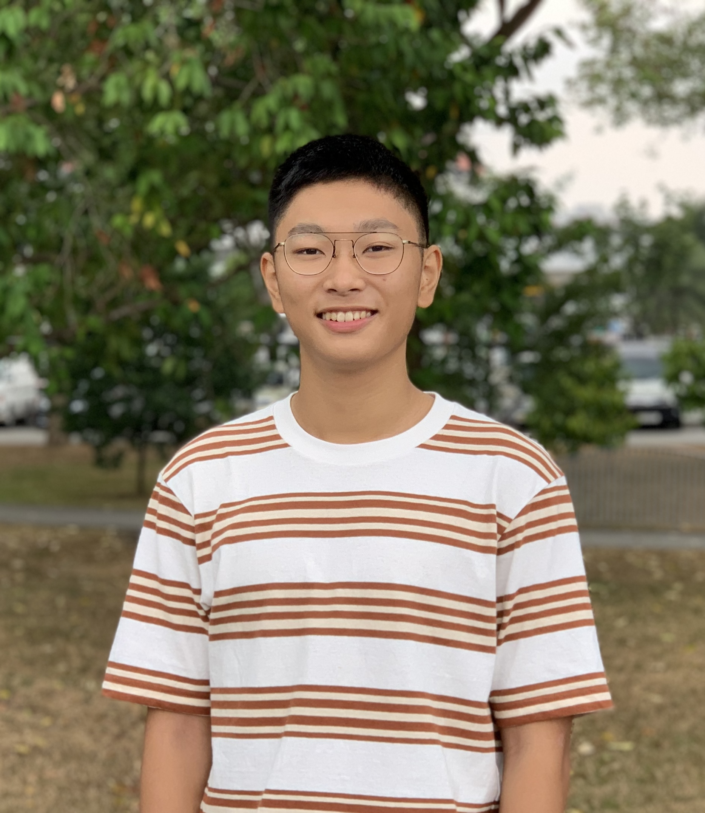
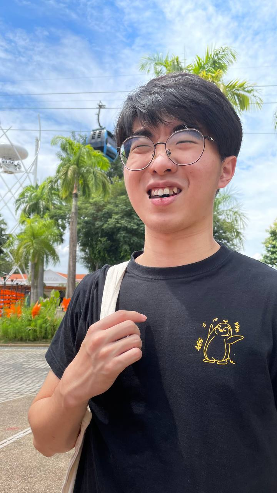

We are a team based in the [School of Computing, National University of Singapore](http://www.comp.nus.edu.sg).

You can reach us at the email `cobb[at]comp.nus.edu.sg`

## Project team

### Qi Zhi

[[github](https://github.com/riccqi)]
[[portfolio](team/riccqi.md)]

* Role: Integration

### Chrysline Lim

[[github](http://github.com/chryslinelim)]
[[portfolio](team/chryslinelim.md)]

* Role: Developer
* Responsibilities: Documentation

### Chng Ian

[[github]](http://github.com/chngchngchng)
[[portfolio]](team/chngchngchng.md)

* Role: Developer
* Responsibilities: CLI Commands, Integration

## Zsigmond Poh

[[github](http://github.com/zsiggg)]
[[portfolio](team/zsiggg.md)]

* Role: Developer
* Responsibilities: Refactoring of previous AB3 code, management of issues on GitHub,
implementing new features

### Chen Hung-Yu

[[github](http://github.com/jchilling)]
[[portfolio](team/jchilling.md)]

* Role: Developer
* Responsibilities: Data
