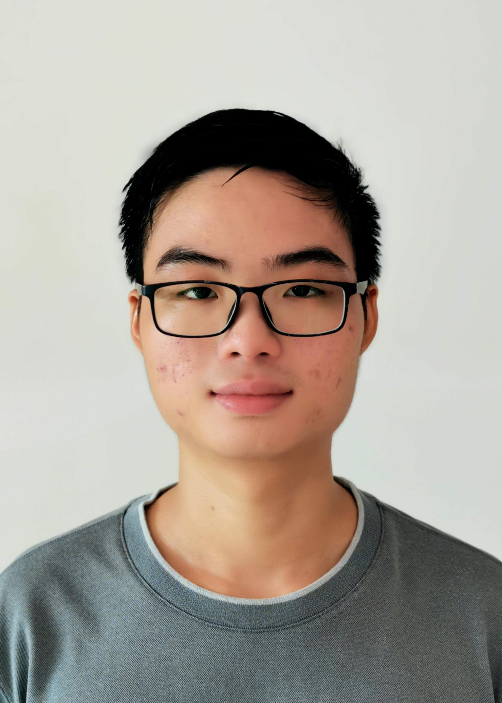
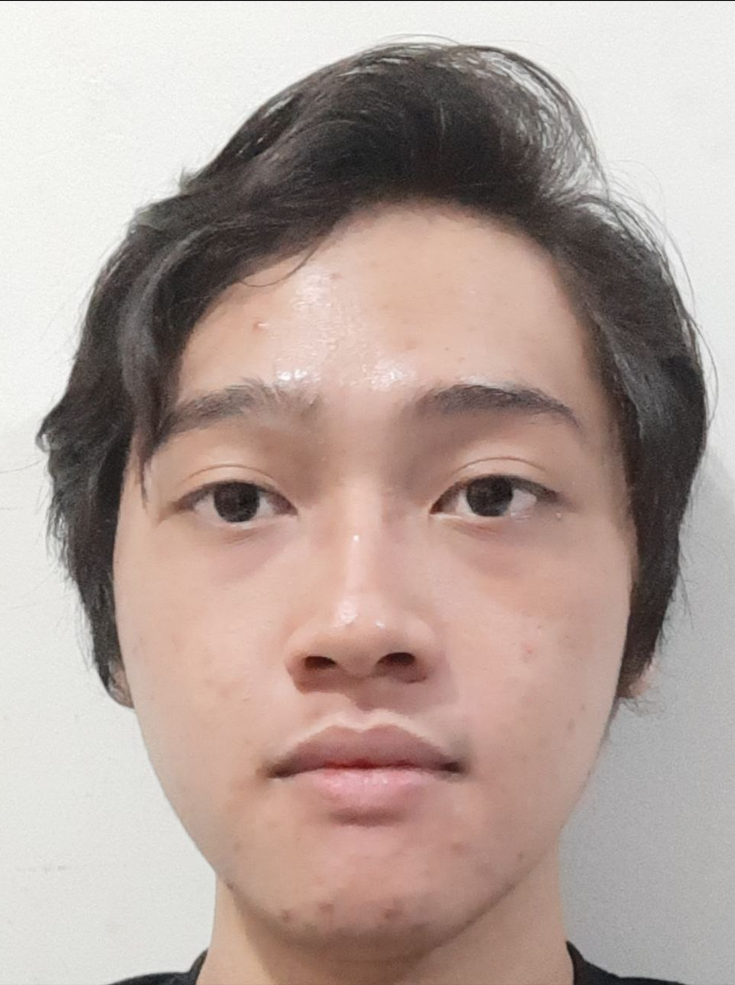
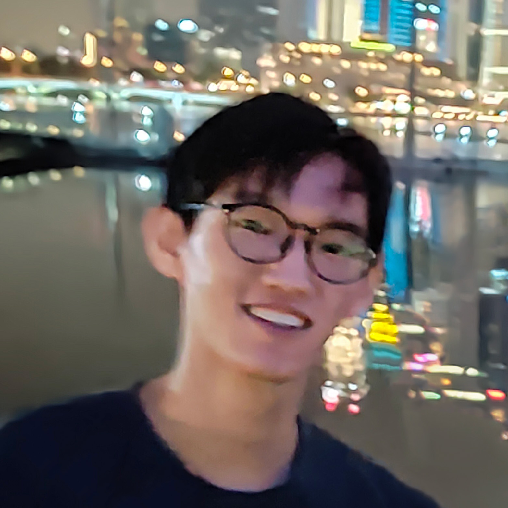

We are a team based in the [School of Computing, National University of Singapore](http://www.comp.nus.edu.sg).

You can reach us at the email `seer[at]comp.nus.edu.sg`

## Project team

### Sim Zhe Feng Kenneth

[[github](http://github.com/kennethsim2000)]
[[portfolio](team/kennethsim2000.md)]

* Role: Team Lead
* Responsibilities: Overall project coordination and code quality

### Aaron Li Wen Hao

[[github](https://github.com/alwhgithub)]
[[portfolio](team/alwhgithub.md)]

* Role: Testing
* Responsibilities: Ensures the testing of the project is done properly and on time

### Albert Ariel Widiaatmaja

[[github](http://github.com/albertarielw)]
[[portfolio](team/albertarielw.md)]

* Role: Management of Deliverables
* Responsibilities: Ensure project deliverables are defined, assigned, and done on time in the right format

### Joe Eng Yu Siang

[[github](http://github.com/yusiangeng)] [[portfolio](team/yusiangeng.md)]

* Role: Integration
* Responsibilities: Code versioning, maintaining code repository, and integrating various parts of the software to create a whole

### Low Zan Hao

[[github](http://github.com/paotheroo)]
[[portfolio](team/paotheroo.md)]

* Role: Documentation
* Responsibilities: Quality of various project documents
