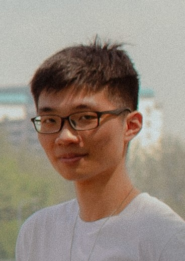
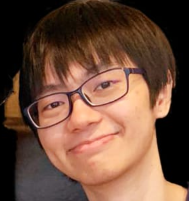
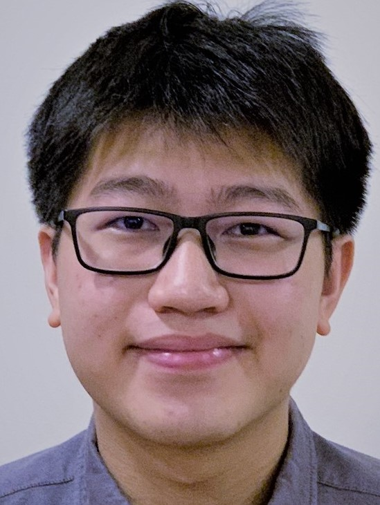
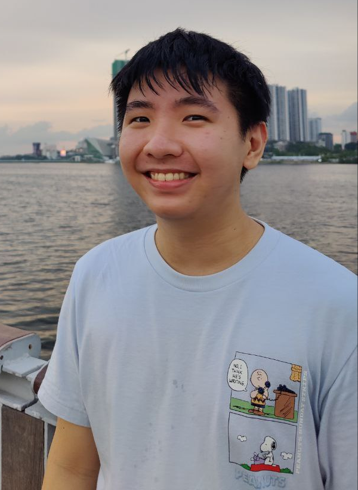
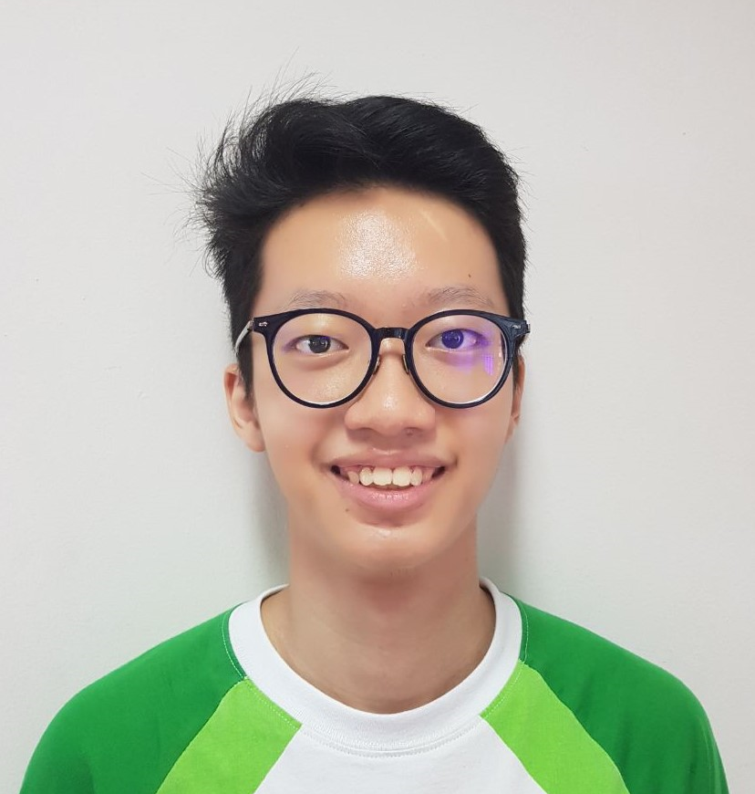

We are a team based in the [School of Computing, National University of Singapore](http://www.comp.nus.edu.sg).

You can reach us at the email `seer[at]comp.nus.edu.sg`

## Project team

### Chen Lyuting

[[github](http://github.com/lyuting47)]
[[portfolio](team/lyuting47.md)]

* Role: Developer
* Responsibilities: Code Quality

### Wayne Zhang Si Yuan

[[github](http://github.com/waynezsy)]
[[portfolio](team/waynezsy.md)]

* Role: Developer
* Responsibilities: Team Lead, Deliverables and Deadlines

### Wong Rende

[[github](http://github.com/wr3nd3)]
[[portfolio](team/wr3nd3.md)]

* Role: Developer
* Responsibilities: Documentation

[[github](http://github.com/tsammeow)]
[[portfolio](team/tsammeow.md)]

* Role: Developer
* Responsibilities: Testing

### Bryan Yang

[[github](http://github.com/thesoggy)]
[[portfolio](team/thesoggy.md)]

* Role: Developer
* Responsibilities: Integration
