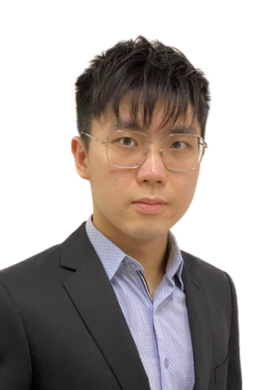

We are a team based in the [School of Computing, National University of Singapore](http://www.comp.nus.edu.sg).

You can reach us at the email `seer[at]comp.nus.edu.sg`.

## Project team

### Jolyn Loh

[[github](https://github.com/jolynloh)]
[[portfolio](team/jolynloh.md)]

* Role: Code quality
* Responsibilities: In charge of `Storage`

### Siew Ee Sung

[[github](http://github.com/eesung00)]
[[portfolio](team/eesung00.md)]

* Role: Testing
* Responsibilities: In charge of `Commons`, assisting in `Model`.

### Chee Jer Hong

[[github](http://github.com/jhchee18)]
[[portfolio](team/jhchee18.md)]

* Role: Deliverables and deadlines
* Responsibilities: In charge of `Model` and `UI`

### Tai Tze Kin

[[github](http://github.com/teekaytai)]
[[portfolio](team/teekaytai.md)]

* Role: Team lead
* Responsibilities: In charge of `Commands`

### Nguyen Minh Tuan

[[github](http://github.com/nmtuan2001)]
[[portfolio](team/nmtuan2001.md)]

* Role: Integration
* Responsibilities: In charge of `Parser`
