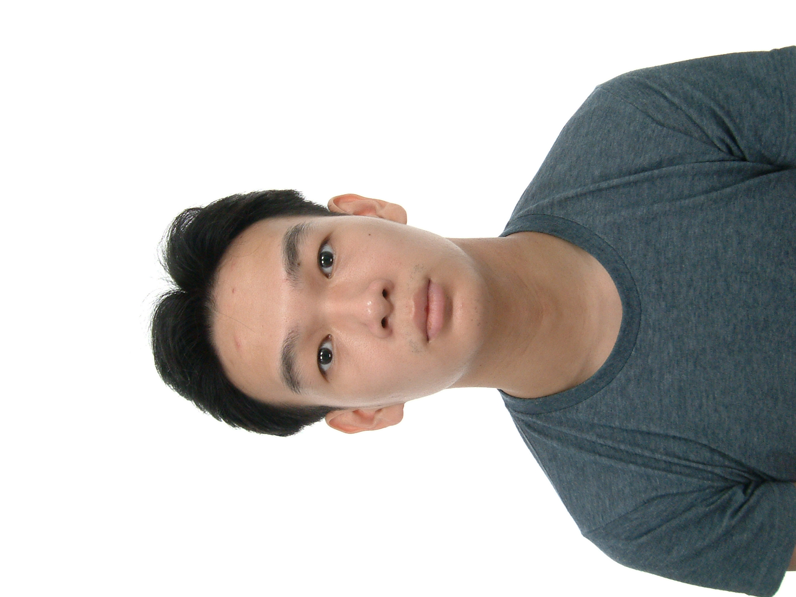

We are a team based in the [School of Computing, National University of Singapore](http://www.comp.nus.edu.sg).

You can reach us at the sets `seer[at]comp.nus.edu.sg`

[[homepage](https://ay2223s1-cs2103t-t15-4.github.io/tp/)]

## Project team

### Donovan Lee Jun Hao

[[github](https://github.com/24Donovan24)]
[[portfolio](team/24donovan24.md)]

* Role: Project Advisor

### Ervin Kin Zhe Zheng

[[github](https://github.com/ErvinK123)]
[[portfolio](team/ervink123.md)]

* Role: Team Lead
* Responsibilities: UI

### Kavan Tan

[[github](http://github.com/kavantan)]
[[portfolio](team/kavantan.md)]

* Role: Developer
* Responsibilities: Data

### Kok Ee Suan

[[github](http://github.com/ee-suan)]
[[portfolio](team/ee-suan.md)]

* Role: Developer
* Responsibilities: Dev Ops + Threading

### Steven Lim

[[github](http://github.com/stevenlimhw)]
[[portfolio](team/stevenlimhw.md)]

* Role: Developer
* Responsibilities: Backend
