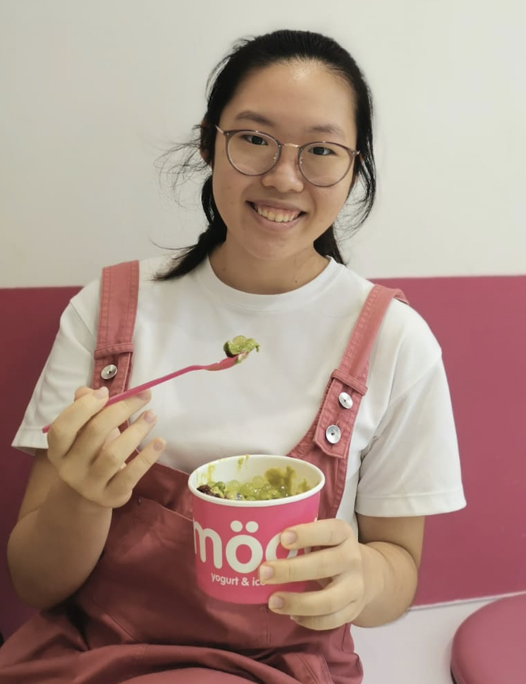
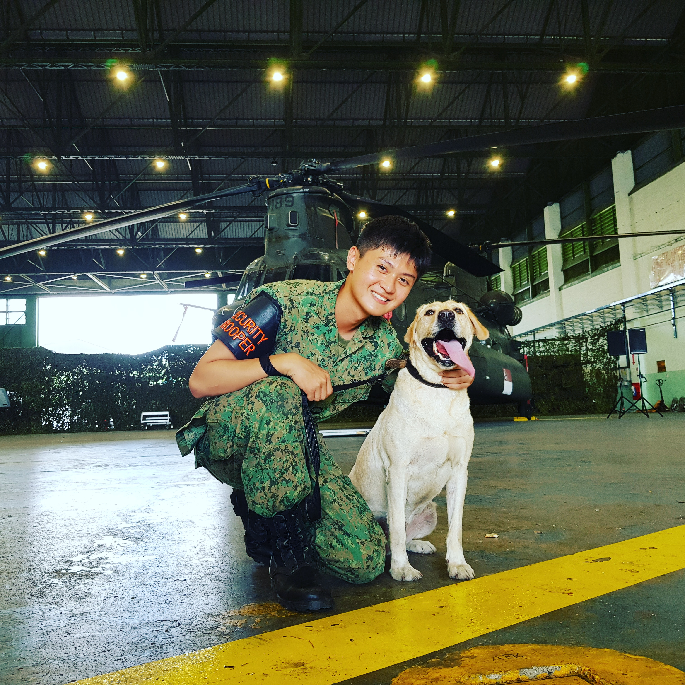

We are a team based in the [School of Computing, National University of Singapore](http://www.comp.nus.edu.sg).

You can reach us at the email `seer[at]comp.nus.edu.sg`

## Project team

### Lim Jun Hong, Don

[[github](https://github.com/donljh)]
[[portfolio](team/donljh.md)]

* Role: Team lead
* Responsibilities: Overall project coordination, integration and code quality control

### Melissa Anastasia Harijanto

[[github](http://github.com/melissaharijanto)]
[[portfolio](team/melissaharijanto.md)]

* Role: Developer
* Responsibilities: UI

### Janelle Loh Jen Teng

[[github](http://github.com/janelleljt)]
[[portfolio](team/janelleljt.md)]

- Role: Developer
- Responsibilities: Documentation

### Yang Jiacheng

[[github](http://github.com/jiacheng-y)]
[[portfolio](team/jiacheng-y.md)]

- Role: Developer
- Responsibilities: Testing

### Soh Enze

[[github](http://github.com/sohenze)]
[[portfolio](team/sohenze.md)]

- Role: Developer
- Responsibilities: Feature design
