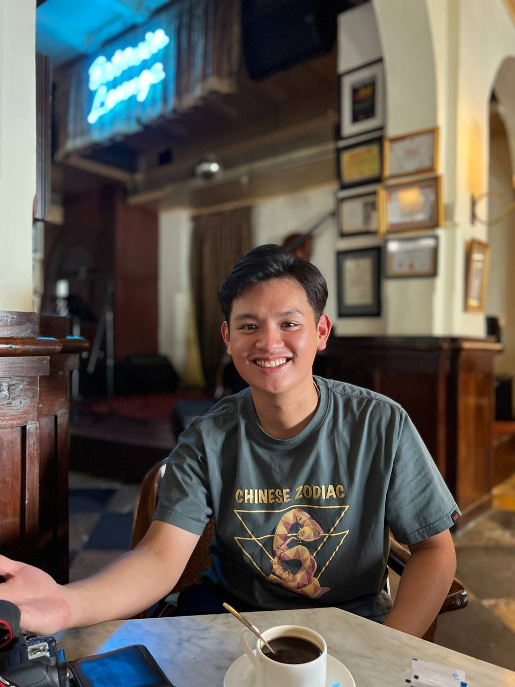

We are a team based in the [School of Computing, National University of Singapore](http://www.comp.nus.edu.sg).

You can reach us at the email `seer[at]comp.nus.edu.sg`

## Project team

### Lee Sen Wei

[[github](https://github.com/senwei01)]
[[portfolio](team/senwei01.md)]

* Role: Project Advisor

### Chew Yew Keng

[[github](http://github.com/rgonslayer)]
[[portfolio](team/rgonslayer.md)]

* Role: Team Lead
* Responsibilities: UI

### Wong Yew Jon

[[github](http://github.com/wongyewjon)]
[[portfolio](team/wongyewjon.md)]

* Role: Developer
* Responsibilities: Data

### Muhammad Mus'ab Bin Mustaffa

[[github](http://github.com/muhdmusab)]
[[portfolio](team/muhdmusab.md)]

* Role: Developer
* Responsibilities: Dev Ops + Threading

### Gerald Teo Jin Wei

[[github](http://github.com/jialatteo)]
[[portfolio](team/jialatteo.md)]

* Role: Developer
* Responsibilities: UI
