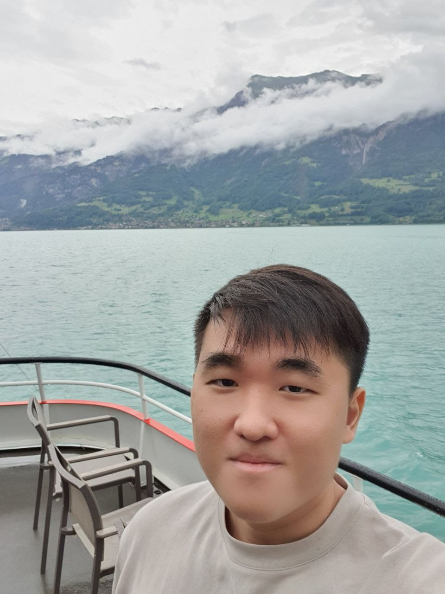

We are a team based in the [School of Computing, National University of Singapore](http://www.comp.nus.edu.sg).

## Project team

### Anthony Ho

[[github](https://github.com/anthonyhoth)]
[[portfolio](team/anthonyhoth.md)]

* Role: Developer
* Responsiblities: In charge of `delete`, `rdelete`, `edit`, `redit` commands and the User Guide.

### Lai Han Wen

[[github](https://github.com/hanwenlai)]
[[portfolio](team/hanwenlai.md)]

* Role: Developer
* Responsiblities: In charge of `list` and `rlist` commands and the Developer Guide.

### Marcus Lee

[[github](https://github.com/marclzh)]
[[portfolio](team/marclzh.md)]

* Role: Developer
* Responsibilities: In charge of `clear`, `rclear`, `appt` and `apptcl` commands  and the User Guide.

### Eiffel Leo

[[github](http://github.com/eiffellkf)]
[[portfolio](team/eiffellkf.md)]

* Role: Developer
* Responsibilities: In charge of `add` and `radd` command and the User Guide.

### Sean Lam

[[github](https://github.com/ljxsean)]
[[portfolio](team/ljxsean.md)]

* Role: Developer
* Responsiblities: In charge of `find` and `rfind` commands and the Developer Guide.
