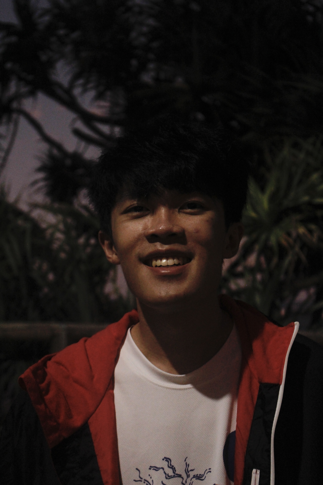

We are a team based in the [School of Computing, National University of Singapore](http://www.comp.nus.edu.sg).

You can reach us at the email `seer[at]comp.nus.edu.sg`

## Project team

### Ryan Guai

[[github](https://github.com/ryanguai)]
[[portfolio](team/ryanguai.md)]

* Role: Team Lead

### Nicole Lee Siying

[[github](http://github.com/nickeltea)]
[[portfolio](team/nickeltea.md)]

* Role: Documentation
* Responsibilities: Quality of project documents

### Tan Jun Wei

[[github](http://github.com/junwei-tan)] [[portfolio](team/junwei-tan.md)]

* Role: Developer
* Responsibilities: Testing

### Felicia Gan

[[github](http://github.com/feliciagan)]
[[portfolio](team/feliciagan.md)]

* Role: Code Quality

### Alvin Tan

[[github](http://github.com/alvintfl)]
[[portfolio](team/alvintfl.md)]

* Role: Integration
* Responsibilities: UI
